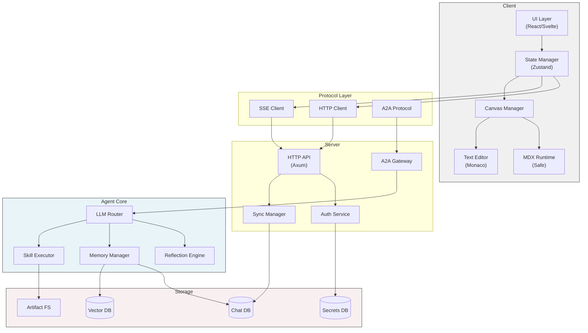
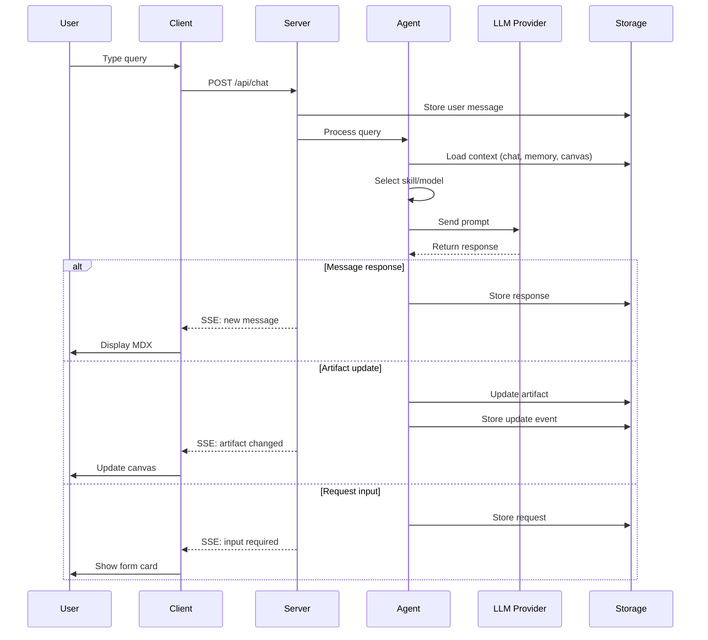
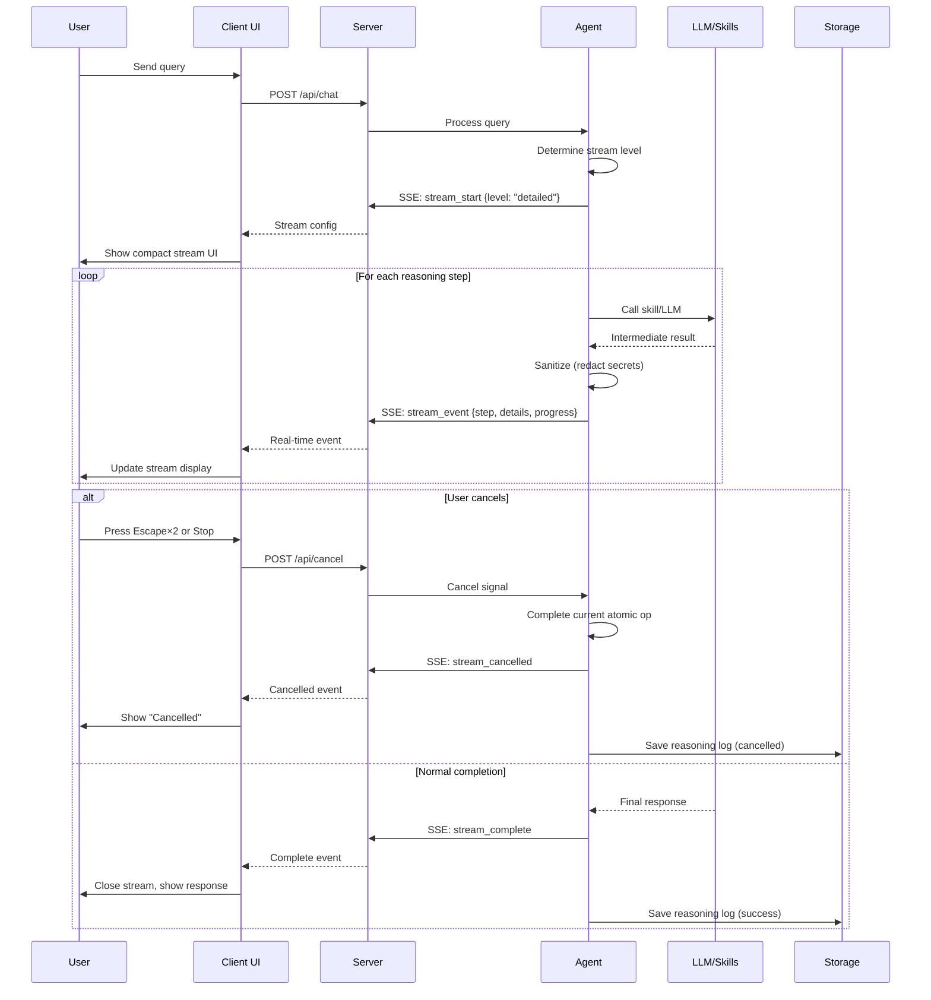
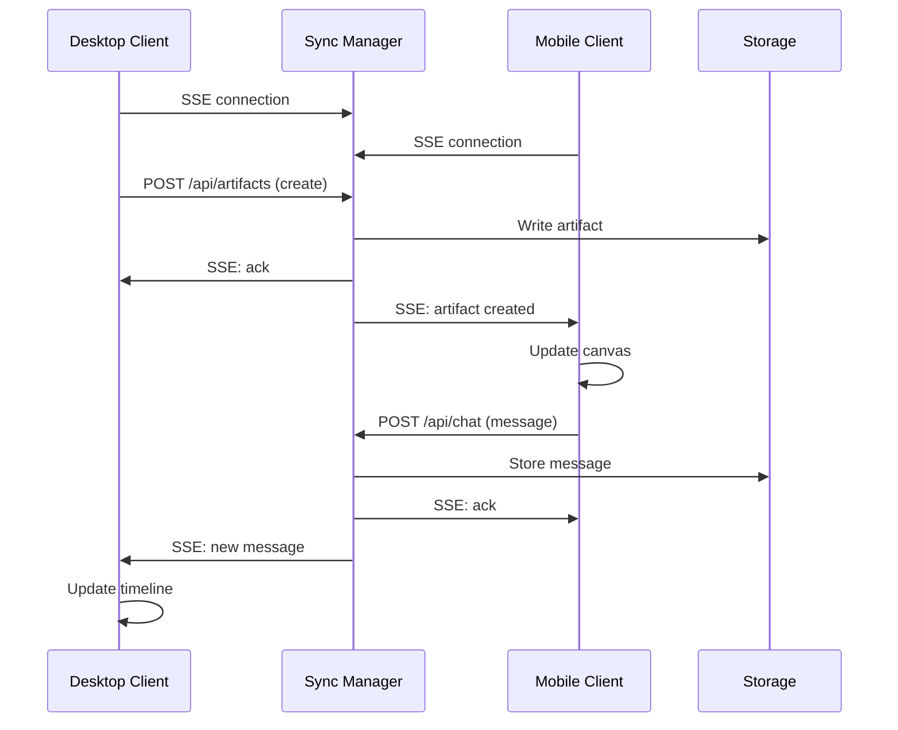

# Attaché Architecture

> **Navigation**: [Overview](./README.md) | [Specification](./SPEC.md) | [Architecture](./ARCHITECTURE.md) | [UX](./UX.md) | [Test Cases](./TEST-CASES.md)

## Table of Contents

- [System Components](#system-components)
- [Data Flow](#data-flow)
- [Client Architecture](#client-architecture)
- [Server Architecture](#server-architecture)
- [Agent Architecture](#agent-architecture)
- [Sync Strategy](#sync-strategy)
- [Security Architecture](#security-architecture)

## System Components

### Component Diagram



## Data Flow

### User Query Flow



### Stream of Consciousness Flow



**Stream Event Flow**:
1. Agent emits `stream_start` with config (level, show_eta)
2. UI initializes compact display (3 lines)
3. Agent streams `stream_event` for each step (sanitized)
4. UI updates in real-time (auto-scroll oldest out)
5. User can [⛶] maximize to see full history
6. On cancel or complete: stream ends, log saved

**Cancel Handling**:
```rust
// Client-side cancel
pub async fn handle_cancel(&self, query_id: &str) -> Result<(), CancelError> {
    // Send cancel to server
    self.api.post_cancel(query_id).await?;
    
    // UI shows "Cancelling..." immediately
    self.ui.show_cancelling();
    
    // Wait for agent acknowledgment
    match self.wait_for_cancel_ack(query_id).await {
        Ok(_) => self.ui.show_cancelled(),
        Err(_) => self.ui.show_cancel_failed(),
    }
}

// Server/agent-side cancel
pub async fn process_cancel(&mut self, query_id: &str) {
    // Mark for cancellation
    self.cancel_flags.insert(query_id, true);
    
    // Agent checks flag between atomic operations
    // Completes current operation, then stops
}
```

### Cross-Device Sync Flow



## Client Architecture

### Desktop (Tauri)

```rust
// src-tauri/src/main.rs
fn main() {
    tauri::Builder::default()
        .invoke_handler(tauri::generate_handler![
            api::get_artifacts,
            api::create_artifact,
            api::update_artifact,
            api::delete_artifact,
            api::send_message,
            api::sync_state,
            secrets::set_secret,
            secrets::list_secrets,
        ])
        .run(tauri::generate_context!())
        .expect("error while running tauri application");
}
```

```typescript
// Frontend architecture
// src/
├── App.tsx                 # Main app component
├── components/
│   ├── ChatPanel.tsx      # Chat timeline
│   ├── CanvasPanel.tsx     # Artifact workspace
│   ├── ArtifactEditor.tsx  # Text editor wrapper
│   ├── CardRenderer.tsx    # Safe MDX runtime
│   └── SecretsPanel.tsx    # Secrets management
├── stores/
│   ├── chatStore.ts       # Chat state
│   ├── canvasStore.ts     # Canvas state
│   └── syncStore.ts       # Sync/connection state
├── runtime/
│   ├── mdxCompiler.ts     # MDX → JSX
│   ├── safeRuntime.ts     # Sandboxed execution
│   └── componentRegistry.ts # Skill components
└── api/
    ├── client.ts          # HTTP client
    └── sse.ts             # SSE connection
```

### State Management

```typescript
// stores/chatStore.ts
interface ChatState {
  events: TimelineEvent[];
  isLoading: boolean;
  
  // Actions
  sendMessage: (content: string) => Promise<void>;
  appendEvent: (event: TimelineEvent) => void;
  loadHistory: (cursor?: string) => Promise<void>;
}

// stores/canvasStore.ts
interface CanvasState {
  artifacts: Artifact[];
  activeTab: string;
  openTabs: string[];
  
  // Actions
  createArtifact: (type: ArtifactType, initial: any) => Promise<void>;
  updateArtifact: (id: string, updates: Partial<Artifact>) => Promise<void>;
  closeTab: (id: string) => void;
  switchTab: (id: string) => void;
}
```

### Safe MDX Runtime

```typescript
// runtime/safeRuntime.ts
export class SafeRuntime {
  private sandbox: iframe | WebWorker;
  private registry: ComponentRegistry;
  
  async compile(mdx: string): Promise<Component> {
    // 1. Parse MDX to AST
    const ast = parseMDX(mdx);
    
    // 2. Validate (no disallowed imports)
    this.validateAST(ast);
    
    // 3. Transform to safe JSX
    const safeJSX = this.transform(ast);
    
    // 4. Bundle with component registry
    const bundle = await this.bundle(safeJSX);
    
    // 5. Execute in sandbox
    return this.executeInSandbox(bundle);
  }
  
  private validateAST(ast: AST): void {
    // No import statements
    // No JSX spread props
    // No dynamic component names
    // Whitelist only built-in + registered components
  }
}
```

### TUI (Ratatui) with Filesystem Canvas

**Filesystem-First Architecture**:

```
tui/src/
├── main.rs                 # Entry point
├── app.rs                  # App state + tabs
├── canvas/                 # Filesystem canvas (NEW)
│   ├── mod.rs             # Canvas coordinator
│   ├── config.rs          # Config loading (.attache/config.yaml)
│   ├── watcher.rs         # Filesystem watcher (notify)
│   ├── tracker.rs         # Change deduplication
│   ├── executor.rs        # Command executor
│   └── offline.rs         # Offline batching
├── chat/                  # Chat interface
│   ├── mod.rs
│   ├── input.rs
│   └── history.rs
├── ui/                    # UI components
│   ├── mod.rs
│   ├── files.rs          # File browser
│   ├── diff.rs           # Git-style diff view
│   └── status.rs         # Status bar
├── sync/                  # Sync management
│   ├── mod.rs
│   ├── sse.rs
│   └── batch.rs
└── skills/               # Local skills (filesystem)
    ├── mod.rs
    ├── loader.rs         # Load from .agents/skills
    └── runtime.rs
```

**Canvas Module**:

```rust
// tui/src/canvas/mod.rs
pub struct FilesystemCanvas {
    /// Configuration from .attache/config.yaml
    config: CanvasConfig,
    
    /// Root directory path
    root: PathBuf,
    
    /// Filesystem watcher
    watcher: FsWatcher,
    
    /// Change tracker (deduplication)
    tracker: ChangeTracker,
    
    /// Command executor
    executor: CommandExecutor,
    
    /// Offline manager
    offline: OfflineManager,
    
    /// Local skills (from filesystem)
    local_skills: Vec<Skill>,
    
    /// Current file tree
    file_tree: FileTree,
    
    /// Modified files (unsynced)
    modified: HashSet<PathBuf>,
}

impl FilesystemCanvas {
    /// Initialize canvas from config
    pub async fn init(config_path: Option<PathBuf>) -> Result<Self, CanvasError> {
        let config = Self::discover_config(config_path).await?;
        let root = config.canonical_root()?;
        
        // Load local skills
        let local_skills = Self::load_local_skills(&config.skills.locations).await?;
        
        // Initialize watcher
        let watcher = FsWatcher::new(&root, &config.canvas).await?;
        
        // Initialize command executor
        let executor = CommandExecutor::new(&root, &config.commands)?;
        
        // Initialize offline manager
        let offline = OfflineManager::new(config.sync.batch_window);
        
        Ok(Self {
            config,
            root,
            watcher,
            tracker: ChangeTracker::new(),
            executor,
            offline,
            local_skills,
            file_tree: FileTree::new(&root).await?,
            modified: HashSet::new(),
        })
    }
    
    /// Handle filesystem change
    pub async fn on_file_change(&mut self, path: PathBuf, change: ChangeType) {
        // Check if this is an agent change (ignore)
        if self.tracker.is_agent_change(&path) {
            return;
        }
        
        // Debounce
        if !self.tracker.should_process(&path) {
            return;
        }
        
        // Mark as modified
        self.modified.insert(path.clone());
        
        // Queue for sync (or batch if offline)
        let file_change = FileChange {
            path: path.clone(),
            change_type: change,
            timestamp: SystemTime::now(),
            diff: self.generate_diff(&path).await.ok(),
        };
        
        if self.offline.state() == ConnectionState::Online {
            // Sync immediately (or debounced)
            self.sync_change(file_change).await;
        } else {
            // Queue for batch
            self.offline.queue_change(file_change);
        }
        
        self.tracker.mark_processed(&path);
    }
    
    /// Execute command and send output to agent
    pub async fn execute_command(&mut self, cmd: &str, agent: &AgentClient) -> Result<(), ExecutionError> {
        let result = self.executor.execute(cmd).await?;
        
        // Send output to agent
        agent.send_command_output(&result).await?;
        
        Ok(())
    }
    
    /// Edit file in $EDITOR
    pub fn edit_file(&self, path: &Path) -> Result<(), EditorError> {
        let editor = self.config.editor.command()
            .or_else(|| env::var("EDITOR").ok())
            .unwrap_or("vi");
        
        let mut cmd = Command::new(editor);
        cmd.arg(path)
            .current_dir(&self.root);
        
        // Suspend TUI, launch editor
        let status = cmd.status()?;
        
        // Resume TUI
        if status.success() {
            Ok(())
        } else {
            Err(EditorError::ExitCode(status.code().unwrap_or(-1)))
        }
    }
}
```

**Filesystem Watcher**:

```rust
// tui/src/canvas/watcher.rs
pub struct FsWatcher {
    watcher: RecommendedWatcher,
    debounce: Duration,
    include: Vec<Pattern>,
    exclude: Vec<Pattern>,
}

impl FsWatcher {
    pub async fn new(root: &Path, config: &CanvasConfig) -> Result<Self, WatcherError> {
        let (tx, mut rx) = mpsc::channel(100);
        
        let mut watcher = notify::recommended_watcher(move |res| {
            if let Ok(event) = res {
                let _ = tx.try_send(event);
            }
        })?;
        
        // Watch the root recursively
        watcher.watch(root, RecursiveMode::Recursive)?;
        
        // Compile patterns
        let include = config.include.iter()
            .map(|p| Pattern::new(p))
            .collect::<Result<Vec<_>, _>>()?;
        let exclude = config.exclude.iter()
            .map(|p| Pattern::new(p))
            .collect::<Result<Vec<_>, _>>()?;
        
        Ok(Self {
            watcher,
            debounce: Duration::from_millis(500),
            include,
            exclude,
        })
    }
    
    /// Check if path matches include/exclude patterns
    pub fn should_watch(&self, path: &Path) -> bool {
        let path_str = path.to_string_lossy();
        
        // Check excludes first
        if self.exclude.iter().any(|p| p.matches(&path_str)) {
            return false;
        }
        
        // Check includes
        self.include.iter().any(|p| p.matches(&path_str))
    }
}
```

**Change Tracker** (Agent Deduplication):

```rust
// tui/src/canvas/tracker.rs
pub struct ChangeTracker {
    /// Changes made by agent (to ignore)
    agent_changes: Arc<RwLock<HashMap<PathBuf, SystemTime>>>,
    
    /// Recently processed (for debouncing)
    recent: Arc<RwLock<HashMap<PathBuf, SystemTime>>>,
    
    /// Debounce duration
    debounce: Duration,
}

impl ChangeTracker {
    /// Called before agent writes file
    pub fn pre_agent_write(&self, path: &Path) {
        self.agent_changes.write().insert(
            path.to_owned(),
            SystemTime::now()
        );
    }
    
    /// Check if change should be processed
    pub fn should_process(&self, path: &Path) -> bool {
        let now = SystemTime::now();
        
        // Check agent changes
        if let Some(time) = self.agent_changes.read().get(path) {
            if time.elapsed().unwrap_or(Duration::MAX) < Duration::from_secs(5) {
                return false;
            }
        }
        
        // Check recent changes (debounce)
        if let Some(time) = self.recent.read().get(path) {
            if time.elapsed().unwrap_or(Duration::MAX) < self.debounce {
                return false;
            }
        }
        
        true
    }
    
    /// Mark change as processed
    pub fn mark_processed(&self, path: &Path) {
        self.recent.write().insert(path.to_owned(), SystemTime::now());
        
        // Cleanup old entries periodically
        if self.recent.read().len() > 1000 {
            let cutoff = SystemTime::now() - Duration::from_secs(60);
            self.recent.write().retain(|_, t| *t > cutoff);
        }
    }
}
```

**Command Executor**:

```rust
// tui/src/canvas/executor.rs
pub struct CommandExecutor {
    allowlist: Vec<String>,
    require_approval: bool,
    allow_all: bool,
    working_dir: PathBuf,
}

impl CommandExecutor {
    pub async fn execute(&self, cmd: &str) -> Result<CommandResult, ExecutionError> {
        // Check if allowlisted
        if !self.is_allowlisted(cmd) && !self.allow_all {
            if self.require_approval {
                // This would trigger TUI prompt
                return Err(ExecutionError::RequiresApproval);
            } else {
                return Err(ExecutionError::NotWhitelisted);
            }
        }
        
        let start = Instant::now();
        
        let output = tokio::process::Command::new("sh")
            .arg("-c")
            .arg(cmd)
            .current_dir(&self.working_dir)
            .stdout(Stdio::piped())
            .stderr(Stdio::piped())
            .output()
            .await?;
        
        Ok(CommandResult {
            command: cmd.to_string(),
            stdout: String::from_utf8_lossy(&output.stdout).to_string(),
            stderr: String::from_utf8_lossy(&output.stderr).to_string(),
            exit_code: output.status.code().unwrap_or(-1),
            duration: start.elapsed(),
        })
    }
    
    fn is_allowlisted(&self, cmd: &str) -> bool {
        let base_cmd = cmd.split_whitespace().next().unwrap_or(cmd);
        self.allowlist.iter().any(|w| {
            w == cmd || w.starts_with(&format!("{} ", base_cmd))
        })
    }
}
```

**Offline Manager**:

```rust
// tui/src/canvas/offline.rs
pub struct OfflineManager {
    state: Arc<RwLock<ConnectionState>>,
    pending: Arc<RwLock<Vec<FileChange>>>,
    batch_window: Duration,
    last_sync: Arc<RwLock<Option<Instant>>>,
}

impl OfflineManager {
    pub async fn check_connection(&self) -> ConnectionState {
        // Ping server
        let new_state = match self.ping().await {
            Ok(_) => ConnectionState::Online,
            Err(_) => ConnectionState::Offline,
        };
        
        let was_offline = *self.state.read() == ConnectionState::Offline;
        *self.state.write() = new_state;
        
        // If just came back online, trigger sync
        if was_offline && new_state == ConnectionState::Online {
            self.sync_pending().await;
        }
        
        new_state
    }
    
    pub fn queue_change(&self, change: FileChange) {
        let mut pending = self.pending.write();
        
        // Deduplicate
        if let Some(existing) = pending.iter_mut().find(|c| c.path == change.path) {
            *existing = change;
        } else {
            pending.push(change);
        }
    }
    
    pub async fn sync_pending(&self) -> Result<(), SyncError> {
        let batch: Vec<FileChange> = {
            let mut pending = self.pending.write();
            if pending.is_empty() {
                return Ok(());
            }
            std::mem::take(&mut *pending)
        };
        
        // Send batch to agent
        let update = BatchUpdate {
            changes: batch,
            summary: format!("{} files modified while offline", batch.len()),
        };
        
        // Send via agent client
        agent.send_batch_update(update).await?;
        
        *self.last_sync.write() = Some(Instant::now());
        Ok(())
    }
}
```

**Local Skills Loader**:

```rust
// tui/src/skills/loader.rs
pub async fn load_local_skills(locations: &[PathBuf]) -> Result<Vec<Skill>, SkillError> {
    let mut skills = Vec::new();
    
    for location in locations {
        if !location.exists() {
            continue;
        }
        
        let mut entries = tokio::fs::read_dir(location).await?;
        
        while let Some(entry) = entries.next_entry().await? {
            let path = entry.path();
            
            if path.extension() == Some("yaml") {
                let content = tokio::fs::read_to_string(&path).await?;
                let mut skill: Skill = serde_yaml::from_str(&content)?;
                
                // Mark as local filesystem skill
                skill.source = SkillSource::Filesystem {
                    path,
                    readonly: true,
                };
                
                skills.push(skill);
            }
        }
    }
    
    Ok(skills)
}
```

**TUI Entry Point**:

```rust
// tui/src/main.rs
mod app;
mod canvas;
mod chat;
mod ui;
mod sync;
mod skills;
async fn main() -> Result<(), Box<dyn std::error::Error>> {
    enable_raw_mode()?;
    
    let backend = CrosstermBackend::new(std::io::stderr());
    let mut terminal = Terminal::new(backend)?;
    
    let mut app = App::new("wss://api.attache.example.com").await?;
    
    loop {
        terminal.draw(|f| ui::draw(f, &mut app))?;
        
        if let Event::Key(key) = event::read()? {
            match key.code {
                KeyCode::Char('q') => break,
                KeyCode::Char('c') => app.focus_chat(),
                KeyCode::Char('v') => app.focus_canvas(),
                KeyCode::Enter => app.submit_message(),
                _ => app.handle_input(key),
            }
        }
        
        // Process SSE messages
        app.process_sync().await?;
    }
    
    disable_raw_mode()?;
    Ok(())
}
```

## Server Architecture

### HTTP API (Axum)

```rust
// server/src/main.rs
use axum::{
    routing::{get, post},
    Router,
};

#[tokio::main]
async fn main() {
    let app = Router::new()
        // Chat API
        .route("/api/chat", post(chat_handler::send_message))
        .route("/api/chat/history", get(chat_handler::get_history))
        
        // Artifact API
        .route("/api/artifacts", get(artifact_handler::list))
        .route("/api/artifacts", post(artifact_handler::create))
        .route("/api/artifacts/:id", get(artifact_handler::get))
        .route("/api/artifacts/:id", put(artifact_handler::update))
        .route("/api/artifacts/:id", delete(artifact_handler::delete))
        
        // Sync API
        .route("/api/sync", get(sync_handler::sse_stream))
        
        // A2A Gateway
        .route("/a2a", post(a2a_handler::handle))
        
        // Auth
        .route("/auth/login", post(auth_handler::login))
        .route("/auth/callback", get(auth_handler::callback));

    axum::serve(tokio::net::TcpListener::bind("0.0.0.0:3000").await.unwrap(), app)
        .await
        .unwrap();
}
```

### Sync Manager (SSE)

```rust
// server/src/sync/mod.rs
use tokio::sync::broadcast;

pub struct SyncManager {
    // User ID -> broadcast channel
    channels: DashMap<String, broadcast::Sender<SyncEvent>>,
}

impl SyncManager {
    pub fn subscribe(&self, user_id: String) -> broadcast::Receiver<SyncEvent> {
        let sender = self.channels
            .entry(user_id.clone())
            .or_insert_with(|| {
                let (tx, _) = broadcast::channel(100);
                tx
            });
        sender.subscribe()
    }
    
    pub fn publish(&self, user_id: &str, event: SyncEvent) {
        if let Some(channel) = self.channels.get(user_id) {
            let _ = channel.send(event);
        }
    }
}

#[derive(Clone, Debug, Serialize)]
pub enum SyncEvent {
    NewMessage(TimelineEvent),
    ArtifactCreated(Artifact),
    ArtifactUpdated { id: String, patch: JSONPatch },
    ArtifactDeleted(String),
    CanvasReordered { order: Vec<String> },
    AgentTyping { active: bool },
}
```

### Request Handler

```rust
// server/src/handlers/chat.rs
pub async fn send_message(
    auth: AuthUser,
    State(state): State<AppState>,
    Json(req): Json<SendMessageRequest>,
) -> Result<Json<MessageResponse>, AppError> {
    // 1. Store user message
    let event = state.db.store_message(auth.user_id(), req).await?;
    
    // 2. Notify all connected clients
    state.sync.publish(&auth.user_id(), SyncEvent::NewMessage(event.clone()));
    
    // 3. Spawn agent processing (non-blocking)
    tokio::spawn(async move {
        let agent = state.agent.for_user(auth.user_id());
        let response = agent.process(event).await;
        
        // Store and broadcast response
        match response {
            AgentResponse::Message(msg) => {
                let event = state.db.store_message(auth.user_id(), msg).await?;
                state.sync.publish(&auth.user_id(), SyncEvent::NewMessage(event));
            }
            AgentResponse::ArtifactUpdate(update) => {
                state.db.update_artifacts(auth.user_id(), &update.changes).await?;
                state.sync.publish(&auth.user_id(), SyncEvent::ArtifactUpdated { ... });
            }
            AgentResponse::RequestInput(request) => {
                state.db.store_request(auth.user_id(), request).await?;
                state.sync.publish(&auth.user_id(), SyncEvent::NewMessage(request.into()));
            }
            AgentResponse::Decline => {
                // No action
            }
        }
    });
    
    // 4. Return immediately (async processing continues)
    Ok(Json(MessageResponse { status: "accepted" }))
}
```

## Agent Architecture

### LLM Router

```rust
// agent/src/router/mod.rs
pub struct LLMRouter {
    providers: HashMap<String, Box<dyn LLMProvider>>,
    cost_tracker: CostTracker,
}

impl LLMRouter {
    pub async fn route(&self, task: &Task) -> Result<Box<dyn LLMProvider>, RouterError> {
        // 1. Check skill hints
        let hints = task.skill_hints();
        
        // 2. Score available providers
        let scores = self.providers.iter()
            .map(|(name, provider)| {
                let score = self.score_provider(provider, hints, task);
                (name.clone(), score)
            })
            .collect::<Vec<_>>();
        
        // 3. Select best available
        let best = scores.iter()
            .filter(|(_, s)| s.available)
            .max_by(|(_, a), (_, b)| a.total_score.partial_cmp(&b.total_score).unwrap())
            .ok_or(RouterError::NoProviderAvailable)?;
        
        Ok(self.providers.get(&best.0).unwrap())
    }
    
    fn score_provider(&self, provider: &dyn LLMProvider, hints: &ModelHints, task: &Task) -> ProviderScore {
        let capability = provider.capability_score(hints);
        let cost = provider.estimated_cost(task);
        let latency = provider.estimated_latency(task);
        let available = provider.is_available();
        
        ProviderScore {
            capability: capability * 0.4,
            cost_efficiency: (1.0 / cost) * 0.3,
            speed: (1.0 / latency) * 0.2,
            reliability: provider.reliability() * 0.1,
            available,
            total_score: capability * 0.4 + (1.0/cost) * 0.3 + (1.0/latency) * 0.2 + provider.reliability() * 0.1,
        }
    }
}
```

### Skill Executor

```rust
// agent/src/skills/executor.rs
pub struct SkillExecutor {
    sandbox: SandboxManager,
    secret_resolver: SecretResolver,
}

impl SkillExecutor {
    pub async fn execute(&self, skill: &Skill, input: Value) -> Result<Value, ExecutionError> {
        // 1. Resolve secrets from Agent Secrets volume ONLY
        // NEVER from TUI, local filesystem, or parent process env
        let env_vars = self.secret_resolver.resolve(&skill.env).await?;
        
        // 2. Spawn sandbox
        let sandbox = self.sandbox.spawn(SandboxConfig {
            image: "python:3.11-slim",
            memory_limit: "512m",
            cpu_limit: "1.0",
            network: NetworkMode::Proxy,  // External calls through proxy
            env_vars,
            timeout: Duration::from_secs(30),
        }).await?;
        
        // 3. Copy skill code
        sandbox.copy_file("/skill/", skill.code()).await?;
        
        // 4. Execute
        let result = sandbox.run("python", &["/skill/main.py", "--input", &input.to_string()]).await?;
        
        // 5. Cleanup
        sandbox.destroy().await?;
        
        // 6. Parse and return
        Ok(serde_json::from_str(&result.stdout)?)
    }
}
```

### Memory Manager

```rust
// agent/src/memory/manager.rs
pub struct MemoryManager {
    vector_store: Arc<dyn VectorStore>,
    document_store: Arc<dyn DocumentStore>,
    embedding_model: Arc<dyn EmbeddingModel>,
}

impl MemoryManager {
    pub async fn search(&self, query: &str, limit: usize) -> Result<Vec<Memory>, MemoryError> {
        // 1. Embed query
        let embedding = self.embedding_model.embed(query).await?;
        
        // 2. Vector search
        let results = self.vector_store.search(embedding, limit).await?;
        
        // 3. Fetch full documents
        let memories = futures::future::try_join_all(
            results.iter().map(|r| self.document_store.get(&r.id))
        ).await?;
        
        Ok(memories)
    }
    
    pub async fn store(&self, memory: Memory) -> Result<(), MemoryError> {
        // 1. Generate embedding
        let embedding = self.embedding_model.embed(&memory.content).await?;
        
        // 2. Store document
        self.document_store.store(&memory).await?;
        
        // 3. Index vector
        self.vector_store.index(memory.id.clone(), embedding).await?;
        
        Ok(())
    }
}
```

## Sync Strategy

### Event Ordering

```rust
// All events carry Lamport timestamp for ordering
#[derive(Clone, Debug, Serialize)]
pub struct SyncEvent {
    lamport_ts: u64,      // Monotonic counter per user
    vector_clock: HashMap<String, u64>,  // Per-device clocks
    payload: EventPayload,
}

// Server is source of truth
// Clients apply events in lamport_ts order
// Conflicts resolved by server timestamp
```

### Conflict Resolution

```rust
// Last-write-wins for most data
// Operational transforms for text artifacts

pub fn resolve_conflict(local: &Artifact, remote: &Artifact, server: &Artifact) -> Artifact {
    match local.type_ {
        ArtifactType::Text => {
            // Use operational transform or diff3
            merge_text(local, remote, server)
        }
        _ => {
            // Last-write-wins based on server timestamp
            if server.modified_at > local.modified_at {
                server.clone()
            } else {
                local.clone()
            }
        }
    }
}
```

### Offline Support

```typescript
// Client-side queue for offline operations
interface OfflineQueue {
  pending: Operation[];
  
  enqueue(op: Operation): void;
  sync(): Promise<void>;  // Replay when online
  resolveConflicts(serverState: State): State;
}
```

## Security Architecture

### Authentication Flow

```
User
  ↓
OAuth Provider (Google, Apple, etc.)
  ↓
Callback to /auth/callback
  ↓
Issue JWT (short-lived access + long-lived refresh)
  ↓
Client stores in keychain/secure storage
  ↓
All API requests include JWT in Authorization header
```

### Authorization

```rust
// Middleware extracts user from JWT
pub async fn require_auth(
    headers: &HeaderMap,
    state: &AppState,
) -> Result<User, AuthError> {
    let token = headers
        .get("authorization")
        .and_then(|h| h.to_str().ok())
        .and_then(|s| s.strip_prefix("Bearer "))
        .ok_or(AuthError::MissingToken)?;
    
    let claims = state.auth.verify_token(token)?;
    
    // Load user
    let user = state.db.get_user(&claims.sub).await?;
    
    // Check volume access
    if !user.has_access_to(&claims.volume) {
        return Err(AuthError::Unauthorized);
    }
    
    Ok(user)
}
```

### Secret Handling

```
User sets secret via UI
  ↓
Client sends to /api/secrets (over TLS)
  ↓
Server encrypts with row-specific key (AES-256-GCM)
  ↓
Store in Secrets DB (value is JWT + encrypted payload)
  ↓
When skill needs secret:
  1. Resolve JWT from DB
  2. Verify signature
  3. Decrypt payload
  4. Inject into sandbox env
  5. Never log or persist unencrypted
```

### Redaction Pipeline

```rust
// Applied to all output paths
pub struct RedactionPipeline {
    patterns: Vec<SecretPattern>,
}

impl RedactionPipeline {
    pub fn process(&self, content: &str) -> String {
        let mut result = content.to_string();
        
        for pattern in &self.patterns {
            result = pattern.redact(&result);
        }
        
        result
    }
}

// Patterns
const PATTERNS: &[SecretPattern] = &[
    SecretPattern::ApiKey,      // sk-... for OpenAI
    SecretPattern::Jwt,         // eyJ... JWTs
    SecretPattern::Base64Secret, // Common secret formats
    SecretPattern::CustomRegex(r"password[:\s]+(\S+)"),
];
```

### Network Security

```
Internet
  ↓
CloudFlare / CDN
  ↓
Load Balancer (TLS termination)
  ↓
API Servers
  ↓
Internal Services (mTLS)
  ↓
Skill Sandbox (no direct network)
  ↓
External API Proxy (monitored, rate-limited)
  ↓
External Services
```

---

*See also: [Overview](./README.md), [Specification](./SPEC.md), [UX](./UX.md), [Test Cases](./TEST-CASES.md)*

---

*Document Version: 1.0*  
*Part of the [Attaché Product Requirements](./README.md)*
