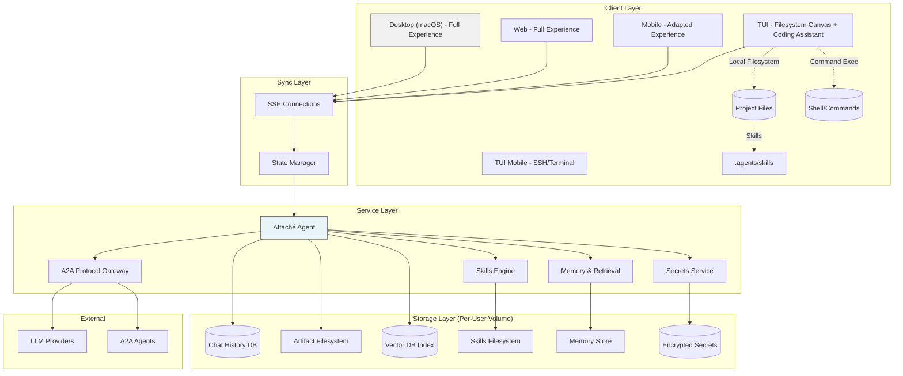
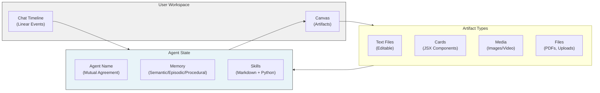

# Attaché - Product Requirements Document

## Overview

**Attaché** is a persistent, inspectable, multi-modal collaboration layer between a human and an autonomous agent over shared state. Unlike chatbots that treat conversation as ephemeral, Attaché treats shared, persistent state as a first-class primitive—a workspace where both human and agent can read, modify, and collaborate over structured artifacts.

The system combines:
- **Linear Chat Timeline**: Append-only event log of all interactions
- **Persistent Canvas**: Editable workspace of artifacts that survive between sessions
- **Stateful Agent**: Autonomous collaborator with memory, reflection, and initiative
- **Cross-Platform Continuity**: Unified experience across desktop, web, mobile, and TUI

### Core Philosophy

> *This is not a chatbot. It is a workspace where an agent co-edits structured state.*

Most systems fake persistence with chat + attachments. Attaché treats shared state as a first-class primitive.

## Documentation

| Document | Description |
|----------|-------------|
| [Overview](./README.md) | Main PRD: concepts, goals, system architecture |
| [Specification](./SPEC.md) | Artifacts, MDX/JSX runtime, skills, memory model |
| [Architecture](./ARCHITECTURE.md) | Components, data flow, sync strategy |
| [UX](./UX.md) | Genesis flow, cone of silence, interaction patterns |
| [Test Cases](./TEST-CASES.md) | Scenarios, edge cases, validation |

## System Architecture

### High-Level Components



### Core Data Model



## Core Concepts

### 1. Chat Timeline
- **Append-only event log** of all interactions
- Chronological, immutable history
- Supports queries like "what restaurant did you mention last week"
- Indexed for semantic retrieval

### 2. Canvas
- **Persistent, editable workspace**
- Artifacts survive between sessions
- Tabbed interface for multiple artifacts
- Both human and agent can add, edit, remove artifacts

### 3. Artifacts
Multi-type content in the canvas:

| Type | Description | Editable |
|------|-------------|----------|
| **Text** | Code, documents, configs | Full editor with syntax highlighting |
| **Card** | JSX components from MDX | Form-based editing of props |
| **Media** | Images, videos, audio | View-only |
| **File** | PDFs, uploads, references | View/summarize only |

### 4. Agent Responses
Agent can respond in multiple ways:

| Type | Description | UX |
|------|-------------|-----|
| **Message** | Standard MDX response | Inline in chat |
| **Artifact Update** | Patches to canvas artifacts | Canvas update + log entry |
| **Request Input** | Form-card for human | Distinct visual, requires response |
| **Decline** | Refuse to respond | Log entry (user query) / No log (spontaneous) |

**Decline Behavior Details**:
- If the user enters a query and the agent declines to answer → **Logged**: "Assistant declined to respond" (shows in timeline)
- If the agent spontaneously declines (e.g., from an auto-trigger) → **Not logged**: Silent decline, no timeline entry

### 5. Stream of Consciousness

Real-time visibility into agent reasoning during processing:

| Feature | Description |
|---------|-------------|
| **Compact UI** | 3-line auto-scrolling display of current activity |
| **Maximize** | Expand to full scrollback with [⛶] button |
| **Auto-close** | Collapses when final response begins |
| **Skill-controlled** | Verbosity set by skill (none/minimal/normal/detailed) |
| **Per-query toggle** | User can override per query |
| **Cancel** | Stop button or Escape×2 to cancel |
| **ETA** | Shows remaining time if skill provides estimate |
| **Privacy** | Secrets redacted automatically |
| **Persistence** | Stored for reflection analysis (low priority) |

**Example**:
```
Compact:  Maximized:
⠋ Researching...        ⏳ Reasoning Stream
→ Running web_search    • 09:00:05 ⠋ Running web_search
→ Reading sources...    • 09:00:08 ✓ Found 12 sources
                   [⛶]  • 09:00:10 ⠋ Reading Wikipedia...
```

### 6. Query Handling & Background Processing

Long-running queries don't block the UI:

| Duration | Behavior | Input Available? |
|----------|----------|------------------|
| **< 10 seconds** | Inline spinner | No (blocked) |
| **> 10 seconds** | Background task, progress indicator | Yes (new queries allowed) |
| **> 3 parallel** | Queue or wait | Depends on config |

**Features**:
- Threshold configurable (default: 10 seconds)
- Max parallel queries: 3 (configurable)
- Background tasks shown with elapsed time
- Notification when background query completes
- Cancel background tasks if needed

### 6. Genesis Experience
New user onboarding:
1. **Genesis event** sent automatically upon signup
2. Agent responds **before** user can query
3. Agent strongly "desires" a name
4. Agent asks for preferred name (required, persistent)
5. Agent continues requesting until provided
6. Name requires **mutual agreement** to change (neither party can rename alone)

### 7. Memory Model

Cognitive-inspired architecture with three memory types:

| Type | Purpose | Content | Source Tiers |
|------|---------|---------|--------------|
| **Semantic** | Factual knowledge | Facts, concepts, preferences | 1st (inferred), 2nd (explicit), 3rd (external) |
| **Episodic** | Event experiences | Chat logs, data fetches, interactions | 1st (agent), 2nd (user), 3rd (external) |
| **Procedural** | Skills & procedures | How to execute tasks | 1st (agent-created), 2nd (user-created), 3rd (community) |

**Source Tiers** (within each type):
- **1st Party**: Agent-inferred or agent-created
- **2nd Party**: User-explicit or user-created
- **3rd Party**: External/imported/community

**Query Routing**:
- "What do you know about X?" → Semantic Memory
- "What did we discuss Y?" → Episodic Memory
- "How do you do Z?" → Procedural Memory

### 8. Cone of Silence
Ephemeral mode for sensitive interactions:
- **No persistence** to primary volume
- **No learning** from session
- Read-only access to primary volume history
- Visual distinction for all interactions within cone
- Multiple active cones allowed (isolated per client)
- Suggestion triggers **after** cone starts (not including triggering query)

### 9. Skills System
Reusable capabilities defined as:
```yaml
name: "web_search"
description: "Search the web for information"
executor: "python"  # Python code
model_hints:
  tier: "fast"      # fast | balanced | advanced
  modality: "text"   # text | vision | multilateral
env:
  - SERP_API_KEY    # Required secrets
```

Skills can:
- Be written in Python (WASM sandbox)
- Call other skills
- Rewrite themselves
- Include JSX components for rendering
- Declare required environment variables

### 10. Reflection System
Periodic self-maintenance:
- Consolidate, rebalance, purge, reindex memory
- Improve skill efficiency
- Detect knowledge gaps
- **Budget-driven**: hourly/daily/extensive phases
- **Reflection queue**: Human or agent can add suggestions for next reflection (short/medium/long/extensive)
- User can request reflection (skill-based, with approval)
- UI shows progress but doesn't block interaction

## Platform Strategy

| Platform | Chat | Canvas | Secrets | Full Cards | Priority |
|----------|------|--------|---------|------------|----------|
| **Desktop (macOS)** | ✅ | ✅ Full | ✅ | ✅ | 1 |
| **Web** | ✅ | ✅ Full | ⚠️ Warn | ✅ | 1 |
| **Mobile** | ✅ | ⚠️ Adapted | ❌ | ⚠️ Key cards | 2 |
| **TUI** | ✅ | ✅ **Filesystem** | ✅ | ❌ Text-only | 3 |
| **TUI Mobile** | ✅ | ⚠️ SSH/Terminal | ❌ | ❌ | 4 |
| **Speech** | 🎤 | ❌ | ❌ | ❌ | 5 |

### TUI Differentiation

**TUI (Terminal User Interface)** is not a lesser experience—it's a **different paradigm** optimized for coding workflows:

| Feature | Desktop GUI | TUI |
|---------|-------------|-----|
| **Canvas** | Virtual artifacts | **Project filesystem** (src/, tests/, etc.) |
| **Editing** | Built-in editor | **$EDITOR** (vim, emacs, code) |
| **File sync** | Manual/agent | **Filesystem watch** (auto-detect) |
| **Skills** | Server registry | **Local .agents/skills** (repo-specific) |
| **Commands** | Agent-run | **User shell** (!cargo test, !npm install) |
| **Offline** | Limited | **Full editing** (batch sync on reconnect) |
| **Use case** | General purpose | **Coding assistant** |

The TUI transforms Attaché into a **local-first coding assistant** where the filesystem IS the canvas.

### Real-Time Sync
- All active clients maintain **SSE (Server-Sent Events)** connection
- State changes pushed to all connected devices
- Device metadata passed to agent for response tuning

## CLI / Entry Points

### Desktop App
```bash
# Launch application
attache-desktop

# Launch with specific profile
attache-desktop --profile work

# Launch in Cone of Silence
attache-desktop --cone-of-silence
```

### TUI (Filesystem Canvas)

```bash
# Start TUI in current directory (auto-discovers .attache/config.yaml)
attache-tui

# Start with specific server
attache-tui --server https://attache.example.com

# Start in specific project directory
attache-tui --project ~/projects/myapp

# Create initial config in current directory
attache-tui --init

# TUI Commands (once running):
#   !<command>     Execute allowlisted command (e.g., !cargo test)
#   e              Open file browser (canvas view)
#   !e <file>      Edit specific file in $EDITOR
#   r              Run default task (from config)
#   s              Sync pending changes
```

### TUI Configuration (`.attache/config.yaml`)

```yaml
version: "1.0"

# Canvas filesystem configuration
canvas:
  root: "."                    # Root directory for canvas
  include:
    - "src/**/*"
    - "tests/**/*"
    - "*.md"
    - "*.rs"
    - "*.py"
  exclude:
    - "node_modules/**"
    - ".git/**"
    - "target/**"
  
  # Permissions
  permissions:
    read: true
    write: true
    execute: true

# Command allowlist
commands:
  allowlist:
    - "cargo test"
    - "cargo build"
    - "npm test"
    - "python -m pytest"
  require_approval: true
  allow_all: false

# Skills discovery
skills:
  locations:
    - ".agents/skills"
    - "../.agents/skills"
  local_precedence: true

# Sync configuration
sync:
  offline_batching: true
  batch_window: 30
```

## Goals & Objectives

### Primary Goals
1. **Persistent State**: Shared workspace that survives sessions
2. **Bidirectional Collaboration**: Both human and agent edit canvas
3. **Multi-Modal**: Text, cards, media, files all first-class
4. **Autonomous Agent**: Self-directed with memory and initiative
5. **Cross-Platform**: Unified experience, device-appropriate
6. **Privacy-First**: Cone of Silence, encrypted secrets, user-owned data
7. **Extensible**: Skills system for custom capabilities

### Success Criteria
- [ ] Genesis experience: automatic onboarding with name acquisition
- [ ] Chat timeline: append-only, indexed, queriable
- [ ] Canvas: multi-tab, editable artifacts, sync across devices
- [ ] Artifacts: text editor with syntax highlighting, card forms, media display
- [ ] Agent responses: message, artifact_update, request_input, decline
- [ ] MDX/JSX runtime: safe sandboxed component rendering
- [ ] Skills system: Python execution, skill-calling-skill, self-modification
- [ ] Memory model: 1st/2nd/3rd party with reflection maintenance
- [ ] Secrets: encrypted storage, JWT-based access, redaction system
- [ ] Cone of Silence: ephemeral volumes, visual distinction, per-client isolation
- [ ] Real-time sync: SSE connections, state reconciliation
- [ ] LLM routing: cost/latency/capability aware with skill hints
- [ ] A2A protocol: Google A2A spec compliance
- [ ] Cross-device: unified history, device-aware responses
- [ ] File processing: upload, store, index, reference
- [ ] Exploration UI: browse memory, skills, artifacts, history
- [ ] TUI: filesystem canvas with $EDITOR integration
- [ ] TUI: command execution with allowlist/approval
- [ ] TUI: filesystem watching with agent change deduplication
- [ ] TUI: offline editing with batch sync
- [ ] TUI: local skills from `.agents/skills`
- [ ] Mobile: adapted experience with location context

## Implementation Phases

### Phase 1: Core Workspace (V1 MVP)
**Duration**: 8 weeks

**Focus**: Desktop (macOS) + Web, core loop functional

- [ ] Chat timeline with MDX rendering
- [ ] Canvas with artifact persistence
- [ ] Text artifact editor (syntax highlighting)
- [ ] Card artifact system (built-in components)
- [ ] Agent loop: message + artifact_update
- [ ] Genesis experience
- [ ] Basic skills (Python sandbox)
- [ ] Memory foundation (1st/2nd party)
- [ ] Secrets panel
- [ ] Real-time sync (SSE)
- [ ] Single LLM provider
- [ ] Cone of Silence basic

### Phase 2: Agent Intelligence
**Duration**: 6 weeks

- [ ] LLM routing with cost optimization
- [ ] A2A protocol gateway
- [ ] Advanced skills (skill-calling-skill)
- [ ] Reflection system (basic)
- [ ] Request_input UX
- [ ] File upload & processing
- [ ] Vector DB integration
- [ ] Mobile app (iOS/Android)

### Phase 3: Scale & Extensibility
**Duration**: 6 weeks

- [ ] TUI client
- [ ] Exploration interface
- [ ] Advanced reflection (budget management)
- [ ] 3rd party data ingestion
- [ ] Custom JSX components in skills
- [ ] Multitenancy
- [ ] Speech interface
- [ ] Self-hosting documentation

### Phase 4: Polish & Distribution
**Duration**: 4 weeks

- [ ] Windows/Linux desktop
- [ ] App Store distribution
- [ ] Performance optimization
- [ ] Documentation & tutorials
- [ ] Community skill marketplace

## Technology Stack

### Client (Desktop)
- **Framework**: Tauri (Rust + Web frontend)
- **Frontend**: React/TypeScript
- **Editor**: Monaco or CodeMirror
- **State**: Zustand or Redux

### Client (TUI)
- **Framework**: Ratatui (Rust)
- **Terminal**: Crossterm

### Server
- **Runtime**: Rust (Tokio)
- **API**: Axum
- **Database**: PostgreSQL (chat), SQLite per-user (config)
- **Vector DB**: Qdrant or pgvector
- **Filesystem**: Local + S3-compatible
- **Sandbox**: Firecracker or gVisor

### Agent
- **Language**: Rust core, Python skills
- **LLM Clients**: OpenAI, Anthropic, Fireworks
- **A2A**: Google A2A protocol spec
- **Protocol**: SSE for streaming

### Security
- **Encryption**: AES-256-GCM (at rest)
- **Secrets**: Row-level keys, JWT access
- **Sandbox**: gVisor/Firecracker
- **Network**: Proxy outside VPC

## Glossary

- **Artifact**: Persistent item in canvas (text, card, media, file)
- **Canvas**: Workspace for artifacts, editable by human and agent
- **Chat Timeline**: Append-only event log of all interactions
- **Genesis**: First-run experience where agent initiates and requests name
- **Cone of Silence**: Ephemeral mode with no persistence or learning
- **Skill**: Reusable capability (Markdown + Python code)
- **Card**: JSX component rendered from MDX, editable via forms
- **Request Input**: Agent-initiated form-card requiring human response
- **Semantic Memory**: Factual knowledge (facts, concepts, preferences) - "what you know"
- **Episodic Memory**: Event experiences (chat logs, data fetches, interactions) - "what happened"
- **Procedural Memory**: Skills and procedures (how to execute tasks) - "how to do it"
- **1st Party**: Source tier - agent-inferred or agent-created content
- **2nd Party**: Source tier - user-explicit or user-created content
- **3rd Party**: Source tier - external or community content
- **Reflection**: Agent self-maintenance process (consolidate, improve)
- **A2A**: Agent-to-Agent protocol (Google spec)
- **Volume**: Per-user storage container (primary + ephemeral cones)
- **Redaction**: Automatic secret scrubbing from all logs/storage

---

*Document Version: 1.0*  
*Part of the [Attaché Product Requirements](./README.md)*
```