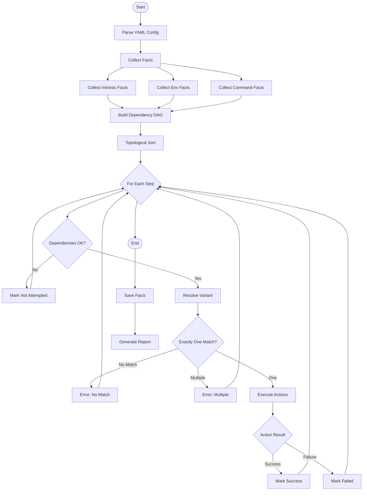
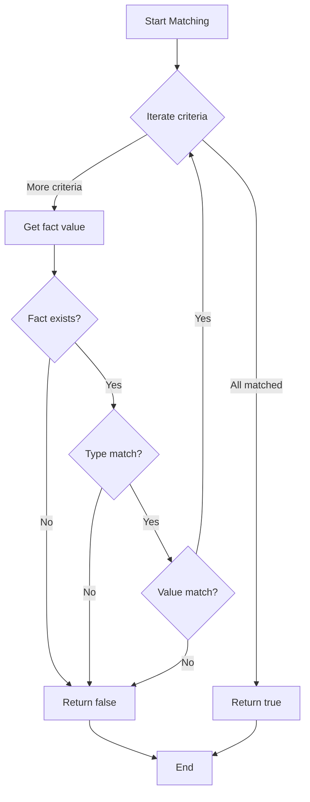

# FactForge Architecture

> **Navigation**: [Overview](./README.md) | [Specification](./SPEC.md) | [Architecture](./ARCHITECTURE.md) | [Test Cases](./TEST-CASES.md)

## Table of Contents

- [Module Structure](#module-structure)
- [Data Types](#data-types)
- [Execution Flow](#execution-flow)
- [Fact Collection](#fact-collection)
- [Variant Resolution](#variant-resolution)
- [Action Execution](#action-execution)
- [Dependency Resolution](#dependency-resolution)
- [Error Handling](#error-handling)

## Module Structure

```
src/
├── main.rs                    # CLI entry point, command routing
├── cli.rs                     # CLI argument parsing (clap)
├── commands/                  # Subcommand implementations
│   ├── mod.rs                 # Command trait definition
│   ├── run.rs                 # Run command
│   ├── plan.rs                # Plan command (dry run)
│   ├── facts.rs               # Facts command
│   ├── check.rs               # Check command
│   ├── init.rs                # Init command
│   ├── schema.rs              # Schema command
│   └── completion.rs          # Shell completion
├── model/                     # Core data structures
│   ├── mod.rs                 # Re-exports
│   ├── config.rs              # Top-level config struct
│   ├── facts.rs               # Fact declarations and values
│   ├── steps.rs               # Step and variant definitions
│   ├── actions.rs             # Action types
│   └── template.rs            # Template interpolation
├── engine/                    # Execution engine
│   ├── mod.rs                 # Engine orchestration
│   ├── fact_collector.rs      # Collects all facts
│   ├── resolver.rs            # Variant resolution
│   ├── executor.rs            # Action execution
│   ├── dependency.rs          # DAG construction and ordering
│   └── reporter.rs            # Execution report generation
├── runtime/                   # Action implementations
│   ├── mod.rs                 # Runtime helpers
│   ├── download.rs            # Download action
│   ├── shell.rs               # Shell action
│   ├── extract.rs             # Extract action
│   ├── write_file.rs          # Write file action
│   └── verify.rs              # SHA256 and GPG verification
├── facts/                     # Fact providers
│   ├── mod.rs                 # Fact provider trait
│   ├── intrinsic.rs           # os, arch, user, uid
│   ├── environment.rs         # Environment variables
│   └── command.rs             # Command execution
└── storage/                   # Saved facts persistence
    ├── mod.rs                 # Storage interface
    └── json_store.rs          # JSON file storage
```

## Data Types

### Core Structs

```rust
// model/config.rs
#[derive(Debug, Deserialize)]
pub struct Config {
    #[serde(default)]
    pub save_facts_to: Option<PathBuf>,
    pub facts: Vec<FactDecl>,
    pub steps: Vec<Step>,
}

// model/facts.rs
#[derive(Debug, Deserialize)]
#[serde(tag = "type", rename_all = "snake_case")]
pub enum FactDecl {
    Intrinsic { name: String },
    Environment { name: String, #[serde(default)] variable: Option<String> },
    Command {
        name: String,
        run: String,
        #[serde(default)] output: OutputKind,
        #[serde(default)] as: FactType,
    },
}

#[derive(Debug, Clone)]
pub enum FactValue {
    String(String),
    Number(f64),
    Semver(Version),  // semver::Version
}

#[derive(Debug, Default)]
pub struct FactSet {
    facts: HashMap<String, FactValue>,
}

// model/steps.rs
#[derive(Debug, Deserialize)]
pub struct Step {
    pub name: String,
    #[serde(default)]
    pub needs: Vec<String>,
    pub variants: Vec<Variant>,
}

#[derive(Debug, Deserialize)]
pub struct Variant {
    pub when: HashMap<String, MatchCriteria>,
    pub actions: Vec<Action>,
}

#[derive(Debug, Deserialize)]
#[serde(untagged)]
pub enum MatchCriteria {
    // For strings - always exact match
    Exact(String),
    
    // For numbers - can be number literal (shorthand) or expression string
    // 42 → "==42"
    // ">5" → greater than 5
    // "<=100" → less than or equal 100
    Number(f64),           // Shorthand: 42
    NumberExpr(String),    // Expression: ">5", "<=10", "==42"
    
    // For semvers - expression string
    // "1.2.3" → "==1.2.3"
    // ">=1.0.0" → greater than or equal
    // "^1.2.3" → compatible
    // "~1.2.3" → approximate
    SemverExpr(String),
}

// model/actions.rs
#[derive(Debug, Deserialize)]
#[serde(tag = "type", rename_all = "snake_case")]
pub enum Action {
    Download {
        url: Template,
        dest: Template,
        #[serde(default)]
        verify: Option<VerifyConfig>,
        #[serde(default)]
        headers: HashMap<String, Template>,
        #[serde(default = "default_true")]
        idempotent: bool,
    },
    Shell {
        run: Template,
        #[serde(default)]
        cwd: Option<Template>,
        #[serde(default)]
        env: HashMap<String, Template>,
        #[serde(default = "default_false")]
        idempotent: bool,
    },
    Extract {
        src: Template,
        dest: Template,
        #[serde(default)]
        strip_components: Option<usize>,
        #[serde(default = "default_true")]
        idempotent: bool,
    },
    WriteFile {
        path: Template,
        content: Template,
        #[serde(default)]
        mode: Option<String>,
        #[serde(default = "default_true")]
        idempotent: bool,
    },
}

#[derive(Debug, Deserialize)]
pub struct VerifyConfig {
    pub sha256: String,
    #[serde(default)]
    pub gpg: Option<String>,
}

// model/template.rs
#[derive(Debug, Clone)]
pub struct Template {
    raw: String,
}

impl Template {
    pub fn render(&self, facts: &FactSet, env: &Env) -> Result<String, TemplateError>;
}
```

## Execution Flow

### High-Level Algorithm

```rust
// engine/mod.rs
pub struct Engine {
    config: Config,
    fact_set: FactSet,
    storage: Box<dyn Storage>,
}

impl Engine {
    pub async fn run(&self, mode: RunMode) -> Result<Report, EngineError> {
        // 1. Collect all facts
        let facts = self.collect_facts().await?;
        
        // 2. Build dependency graph
        let dag = DependencyGraph::build(&self.config.steps)?;
        
        // 3. Get execution order (topological sort)
        let order = dag.topological_sort()?;
        
        // 4. Execute steps in order
        let mut results = Vec::new();
        for step_name in order {
            let step = self.config.find_step(&step_name)?;
            
            // Check if dependencies failed
            if self.has_failed_dependency(&step, &results) {
                results.push(StepResult::NotAttempted { 
                    name: step_name, 
                    reason: "dependency failed".to_string() 
                });
                continue;
            }
            
            // Resolve variant
            let resolution = self.resolve_variant(step, &facts);
            
            match resolution {
                ResolutionResult::NoMatch => {
                    // No matching variant: warning, skip step
                    warn!("Step '{}' has no matching variant, skipping", step_name);
                    results.push(StepResult::Skipped {
                        name: step_name,
                        reason: "no matching variant".to_string(),
                    });
                    continue;
                }
                ResolutionResult::MultipleMatches(n) => {
                    // Multiple matches: fatal error
                    results.push(StepResult::Failed {
                        name: step_name,
                        error: ResolutionError::MultipleMatches(step_name, n),
                    });
                    continue;
                }
                ResolutionResult::Match(variant) => {
                    // Exactly one match: execute actions
                    let result = if mode == RunMode::Plan {
                        self.simulate_actions(step_name, variant, &facts).await
                    } else {
                        self.execute_actions(step_name, variant, &facts).await
                    };
                    results.push(result);
                }
            }
        }
        
        // 5. Save facts if all successful (in run mode)
        if mode == RunMode::Run && self.all_success(&results) {
            self.storage.save(&facts)?;
        }
        
        // 6. Generate report
        Ok(Report::from_results(results))
    }
}
```

### Flow Diagram



## Fact Collection

### Collection Process

```rust
// engine/fact_collector.rs
pub struct FactCollector {
    providers: Vec<Box<dyn FactProvider>>,
}

#[async_trait]
pub trait FactProvider {
    async fn collect(&self) -> Result<Vec<(String, FactValue)>, FactError>;
}

impl FactCollector {
    pub async fn collect_all(&self, decls: &[FactDecl]) -> Result<FactSet, FactError> {
        let mut facts = FactSet::new();
        
        // 1. Collect intrinsic facts
        for decl in decls.iter().filter(|d| matches!(d, FactDecl::Intrinsic { .. })) {
            let (name, value) = self.collect_intrinsic(decl).await?;
            facts.insert(name, value);
        }
        
        // 2. Collect environment facts
        for decl in decls.iter().filter(|d| matches!(d, FactDecl::Environment { .. })) {
            let (name, value) = self.collect_env(decl)?;
            facts.insert(name, value);
        }
        
        // 3. Collect command facts (in parallel where possible)
        let command_decls: Vec<_> = decls.iter()
            .filter(|d| matches!(d, FactDecl::Command { .. }))
            .collect();
            
        for decl in command_decls {
            let (name, stdout, stderr, status) = self.collect_command(decl).await?;
            
            // Insert all three outputs
            facts.insert(format!("{}.stdout", name), stdout);
            facts.insert(format!("{}.stderr", name), stderr);
            facts.insert(format!("{}.status", name), FactValue::Number(status as f64));
            
            // Insert primary value based on output field
            let primary = match decl.output {
                OutputKind::Stdout => facts.get(&format!("{}.stdout", name)).cloned(),
                OutputKind::Stderr => facts.get(&format!("{}.stderr", name)).cloned(),
                OutputKind::Status => facts.get(&format!("{}.status", name)).cloned(),
            };
            if let Some(value) = primary {
                facts.insert(name, value);
            }
        }
        
        // 4. Add built-in reserved facts
        facts.insert("factforge_version".to_string(), 
                     FactValue::String(env!("CARGO_PKG_VERSION").to_string()));
        
        Ok(facts)
    }
}
```

### Command Fact Execution

```rust
// facts/command.rs
pub async fn run_command(cmd: &str) -> Result<CommandOutput, CommandError> {
    let output = tokio::process::Command::new("/bin/sh")
        .arg("-c")
        .arg(cmd)
        .output()
        .await?;
    
    Ok(CommandOutput {
        stdout: String::from_utf8_lossy(&output.stdout).trim().to_string(),
        stderr: String::from_utf8_lossy(&output.stderr).trim().to_string(),
        status: output.status.code().unwrap_or(-1),
    })
}
```

## Variant Resolution

### Resolution Algorithm

```rust
// engine/resolver.rs
pub struct Resolver<'a> {
    facts: &'a FactSet,
}

#[derive(Debug)]
pub enum ResolutionResult<'a> {
    Match(&'a Variant),           // Exactly one variant matches
    NoMatch,                     // No variants match (warning, skip)
    MultipleMatches(usize),      // Multiple variants match (error)
}

impl<'a> Resolver<'a> {
    pub fn resolve(&self, step: &Step) -> ResolutionResult<'a> {
        let matches: Vec<&Variant> = step.variants
            .iter()
            .filter(|v| self.matches(v))
            .collect();
        
        match matches.len() {
            0 => ResolutionResult::NoMatch,
            1 => ResolutionResult::Match(matches[0]),
            n => ResolutionResult::MultipleMatches(n),
        }
    }
    
    fn matches(&self, variant: &Variant) -> bool {
        // All criteria in the when clause must match (AND logic)
        variant.when.iter().all(|(key, criteria)| {
            match self.facts.get(key) {
                Some(fact_value) => self.criteria_matches(criteria, fact_value),
                None => false,  // Missing fact = no match
            }
        })
    }
    
    fn criteria_matches(&self, criteria: &MatchCriteria, fact: &FactValue) -> bool {
        match (criteria, fact) {
            // String: always exact match
            (MatchCriteria::Exact(expected), FactValue::String(actual)) => {
                expected == actual
            }
            
            // Number shorthand (e.g., 42): equality check
            (MatchCriteria::Number(expected), FactValue::Number(actual)) => {
                expected == actual
            }
            
            // Number expression (e.g., ">5", "<=10"): parse and evaluate
            (MatchCriteria::NumberExpr(expr), FactValue::Number(actual)) => {
                evaluate_number_expr(expr, *actual)
            }
            
            // Semver expression: parse and evaluate
            (MatchCriteria::SemverExpr(expr), FactValue::Semver(actual)) => {
                semver_matches(expr, actual)
            }
            
            _ => false,  // Type mismatch = no match
        }
    }
}

fn evaluate_number_expr(expr: &str, actual: f64) -> bool {
    // Parse expressions like: "42", "==42", ">5", "<=10", "<100", ">=0"
    let expr = expr.trim();
    
    if expr.starts_with(">=") {
        let val = expr[2..].parse::<f64>().ok()?;
        actual >= val
    } else if expr.starts_with("<=") {
        let val = expr[2..].parse::<f64>().ok()?;
        actual <= val
    } else if expr.starts_with(">") {
        let val = expr[1..].parse::<f64>().ok()?;
        actual > val
    } else if expr.starts_with("<") {
        let val = expr[1..].parse::<f64>().ok()?;
        actual < val
    } else if expr.starts_with("==") {
        let val = expr[2..].parse::<f64>().ok()?;
        actual == val
    } else {
        // Shorthand equality: just the number
        let val = expr.parse::<f64>().ok()?;
        actual == val
    }
}

fn semver_matches(expr: &str, version: &Version) -> bool {
    // Parse expressions like: "1.2.3", "==1.2.3", ">=1.0.0", "<2.0.0", "^1.2.3", "~1.2.3"
    let expr = expr.trim();
    
    // Handle shorthand equality (bare version)
    if !expr.starts_with(['<', '>', '=', '^', '~'].as_ref()) {
        let req = VersionReq::parse(&format!("^{}", expr)).ok()?;
        return req.matches(version);
    }
    
    // Parse comparison expression
    let req = VersionReq::parse(expr).ok()?;
    req.matches(version)
}
```

### Matching Logic



## Action Execution

### Download Action

```rust
// runtime/download.rs
pub async fn execute_download(
    url: &str,
    dest: &Path,
    verify: Option<&VerifyConfig>,
    headers: &HashMap<String, String>,
    idempotent: bool,
) -> Result<ActionResult, DownloadError> {
    // 1. Idempotency check
    if idempotent {
        if let Some(config) = verify {
            if file_exists_with_hash(dest, &config.sha256).await? {
                return Ok(ActionResult::Skipped("File exists with correct hash"));
            }
        } else if dest.exists() {
            return Ok(ActionResult::Skipped("File exists"));
        }
    }
    
    // 2. Create temp file
    let temp_path = create_temp_file().await?;
    
    // 3. Download
    let client = reqwest::Client::new();
    let mut request = client.get(url);
    for (key, value) in headers {
        request = request.header(key, value);
    }
    let response = request.send().await?;
    let bytes = response.bytes().await?;
    tokio::fs::write(&temp_path, bytes).await?;
    
    // 4. Verify
    if let Some(config) = verify {
        // SHA256 check
        verify_sha256(&temp_path, &config.sha256).await?;
        
        // GPG check if specified
        if let Some(key_id) = &config.gpg {
            let sig_url = format!("{}.sig", url);
            verify_gpg(&temp_path, &sig_url, key_id).await?;
        }
    }
    
    // 5. Atomic move
    tokio::fs::rename(&temp_path, dest).await?;
    
    Ok(ActionResult::Success)
}
```

### Shell Action

```rust
// runtime/shell.rs
pub async fn execute_shell(
    cmd: &str,
    cwd: Option<&Path>,
    env: &HashMap<String, String>,
    _idempotent: bool,  // Shell is never idempotent by default
) -> Result<ActionResult, ShellError> {
    let mut command = tokio::process::Command::new("/bin/sh");
    command.arg("-c").arg(cmd);
    
    if let Some(dir) = cwd {
        command.current_dir(dir);
    }
    
    for (key, value) in env {
        command.env(key, value);
    }
    
    let output = command.output().await?;
    
    if output.status.success() {
        Ok(ActionResult::Success)
    } else {
        let stderr = String::from_utf8_lossy(&output.stderr);
        Err(ShellError::NonZeroExit(output.status.code().unwrap_or(-1), stderr.to_string()))
    }
}
```

### Action Executor

```rust
// engine/executor.rs
pub struct Executor {
    facts: FactSet,
}

impl Executor {
    pub async fn execute(&self, action: &Action) -> Result<ActionResult, ExecutionError> {
        // Render all templates first
        let rendered_action = self.render_action(action).await?;
        
        match rendered_action {
            Action::Download { url, dest, verify, idempotent, .. } => {
                runtime::download::execute(&url, &dest, verify.as_ref(), idempotent).await
            }
            Action::Shell { run, cwd, env, .. } => {
                runtime::shell::execute(&run, cwd.as_deref(), &env, false).await
            }
            Action::Extract { src, dest, strip_components, idempotent } => {
                runtime::extract::execute(&src, &dest, strip_components, idempotent).await
            }
            Action::WriteFile { path, content, mode, idempotent } => {
                runtime::write_file::execute(&path, &content, mode.as_deref(), idempotent).await
            }
        }
    }
    
    async fn render_action(&self, action: &Action) -> Result<Action, TemplateError> {
        // Render all template fields in the action
        // ...
    }
}
```

## Dependency Resolution

### DAG Construction

```rust
// engine/dependency.rs
pub struct DependencyGraph {
    nodes: HashMap<String, Node>,
    edges: Vec<(String, String)>,  // (from, to) meaning "to depends on from"
}

struct Node {
    step: Step,
    state: NodeState,
}

#[derive(Clone, Copy)]
enum NodeState {
    Pending,
    InProgress,
    Success,
    Failed,
    Skipped,
}

impl DependencyGraph {
    pub fn build(steps: &[Step]) -> Result<Self, DependencyError> {
        let mut graph = Self {
            nodes: HashMap::new(),
            edges: Vec::new(),
        };
        
        // Add all nodes
        for step in steps {
            graph.nodes.insert(
                step.name.clone(),
                Node { step: step.clone(), state: NodeState::Pending }
            );
        }
        
        // Add edges from "needs" declarations
        for step in steps {
            for dep in &step.needs {
                if !graph.nodes.contains_key(dep) {
                    return Err(DependencyError::UnknownDependency(step.name.clone(), dep.clone()));
                }
                graph.edges.push((dep.clone(), step.name.clone()));
            }
        }
        
        // Check for cycles
        graph.detect_cycles()?;
        
        Ok(graph)
    }
    
    pub fn topological_sort(&self) -> Result<Vec<String>, DependencyError> {
        // Kahn's algorithm
        let mut in_degree: HashMap<String, usize> = HashMap::new();
        let mut adj: HashMap<String, Vec<String>> = HashMap::new();
        
        // Initialize
        for name in self.nodes.keys() {
            in_degree.insert(name.clone(), 0);
            adj.insert(name.clone(), Vec::new());
        }
        
        // Build adjacency and count in-degrees
        for (from, to) in &self.edges {
            adj.entry(from.clone()).or_default().push(to.clone());
            *in_degree.entry(to.clone()).or_insert(0) += 1;
        }
        
        // Find all nodes with no dependencies
        let mut queue: VecDeque<String> = in_degree.iter()
            .filter(|(_, &count)| count == 0)
            .map(|(name, _)| name.clone())
            .collect();
        
        let mut result = Vec::new();
        
        while let Some(node) = queue.pop_front() {
            result.push(node.clone());
            
            if let Some(neighbors) = adj.get(&node) {
                for neighbor in neighbors {
                    let count = in_degree.get_mut(neighbor).unwrap();
                    *count -= 1;
                    if *count == 0 {
                        queue.push_back(neighbor.clone());
                    }
                }
            }
        }
        
        if result.len() != self.nodes.len() {
            return Err(DependencyError::CycleDetected);
        }
        
        Ok(result)
    }
}
```

## Error Handling

### Error Types

```rust
// errors.rs
#[derive(Debug, thiserror::Error)]
pub enum FactForgeError {
    #[error("Configuration parse error: {0}")]
    ConfigParse(#[from] serde_yaml::Error),
    
    #[error("Fact collection failed: {0}")]
    FactCollection(FactError),
    
    #[error("Step '{step}': multiple matching variants found ({count})")]
    MultipleMatchingVariants { step: String, count: usize },
    
    #[error("Step '{step}': action failed - {source}")]
    ActionFailed { step: String, source: ActionError },
    
    #[error("Circular dependency detected")]
    CircularDependency,
    
    #[error("Checksum verification failed for {file}")]
    ChecksumFailed { file: PathBuf },
    
    #[error("GPG verification failed for {file}")]
    GpgFailed { file: PathBuf },
    
    #[error("Path validation failed: {path} is a protected system path")]
    PathValidation { path: PathBuf },
}

impl FactForgeError {
    pub fn exit_code(&self) -> i32 {
        match self {
            FactForgeError::ConfigParse(_) => 1,
            FactForgeError::FactCollection(_) => 2,
            FactForgeError::MultipleMatchingVariants { .. } => 3,
            FactForgeError::ActionFailed { .. } => 4,
            FactForgeError::CircularDependency => 9,
            FactForgeError::ChecksumFailed { .. } => 6,
            FactForgeError::GpgFailed { .. } => 7,
            FactForgeError::PathValidation { .. } => 8,
        }
    }
}
```

### Error Propagation

```rust
// main.rs
#[tokio::main]
async fn main() {
    match run().await {
        Ok(report) => {
            print_report(&report);
            std::process::exit(report.exit_code());
        }
        Err(e) => {
            eprintln!("Error: {}", e);
            std::process::exit(e.exit_code());
        }
    }
}
```

---

*See also: [Overview](./README.md), [Specification](./SPEC.md), [Test Cases](./TEST-CASES.md)*

---

*Document Version: 1.0*  
*Part of the [FactForge Product Requirements](./README.md)*
