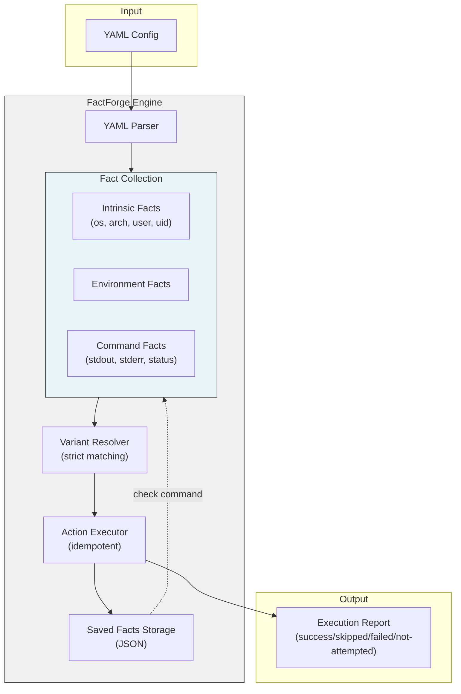
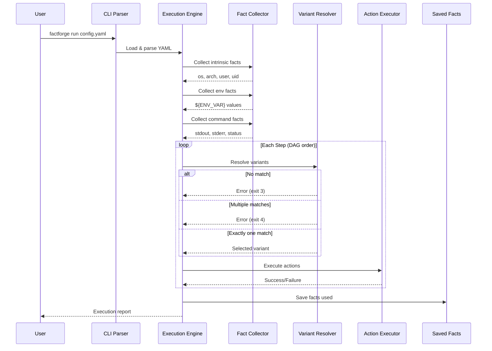

# FactForge - Product Requirements Document

## Overview

**FactForge** is a declarative, fact-driven configuration management tool designed for single-machine environments. Unlike Ansible or other orchestration tools, FactForge has no SSH overhead and is distributed as a single standalone Rust binary. It collects facts about the host machine (some intrinsic, some calculated) and uses those facts to select and execute installation steps.

The core concept is simple: **facts → evaluate variants → pick exactly one → execute actions**. No loops, no partial execution ambiguity, no DAG complexity.

**Primary Use Case**: Developer dotfiles management - the workhorse for installing and updating development tools on personal machines.

## Documentation

| Document | Description |
|----------|-------------|
| [Overview](./README.md) | Main PRD: core concepts, architecture, CLI reference |
| [Specification](./SPEC.md) | YAML schema, fact system, action system, templating |
| [Architecture](./ARCHITECTURE.md) | Rust module structure, data flow, algorithms |
| [Test Cases](./TEST-CASES.md) | Test scenarios for validation |

## Core Concepts

### Mental Model

Each step resolves deterministically:

```
facts → evaluate variants → pick zero or one → execute actions (if matched)
```

- **Facts**: Data points about the machine (OS, architecture, command outputs, environment variables)
- **Variants**: Conditional branches within a step, each with matching criteria
- **Actions**: Imperative operations (download, shell, extract, write_file)

### Matching Rule

Every step must match **zero or one** variant:
- **Zero matches**: Warning - step is skipped (no installation needed for this platform)
- **One match**: Execute that variant's actions
- **Multiple matches**: Error - ambiguous configuration (must be exactly one)

This guarantees determinism: same config + same facts = same result.

## System Architecture

### Data Flow



### Execution Flow



## CLI Reference

### Commands

| Command | Description | Example |
|---------|-------------|---------|
| `run [config.yaml]` | Execute configuration | `factforge run setup.yaml` |
| `plan [config.yaml]` | Dry run - show what would execute | `factforge plan setup.yaml` |
| `facts [config.yaml]` | List all discovered facts | `factforge facts setup.yaml` |
| `check [config.yaml]` | Compare saved facts with current | `factforge check setup.yaml` |
| `init` | Create starter config | `factforge init > setup.yaml` |
| `schema` | Output JSON schema to stdout | `factforge schema > schema.json` |
| `help` | Show help message | `factforge help` |
| `completion <shell>` | Generate shell completions | `factforge completion bash` |

### Global Flags

| Flag | Description | Example |
|------|-------------|---------|
| `--from-stdin` | Read config from stdin | `cat config.yaml \| factforge run --from-stdin` |
| `--json` | Output in JSON format | `factforge plan --json setup.yaml` |
| `--warn-only` | For `check`: warn but don't prompt | `factforge check --warn-only setup.yaml` |

### Examples

```bash
# Run configuration
factforge run dotfiles.yaml

# Dry run with JSON output
factforge plan --json dotfiles.yaml

# Check if facts have changed
factforge check dotfiles.yaml

# Pipe config from stdin
cat <<EOF | factforge run --from-stdin
facts:
  - name: os
    type: intrinsic
steps:
  - name: hello
    variants:
      - when: {}
        actions:
          - type: shell
            run: echo "Hello from {{os}}"
EOF

# Generate completion script
factforge completion bash > /etc/bash_completion.d/factforge
```

## Exit Codes

| Code | Meaning | Description |
|------|---------|-------------|
| `0` | Success | All steps completed successfully (some may have been skipped with warnings) |
| `1` | Config Parse Error | YAML syntax error or invalid schema |
| `2` | Fact Collection Failed | Command fact failed or returned error |
| `3` | Multiple Matching Variants | Step has multiple matching variants (ambiguous - must be exactly one) |
| `4` | Action Execution Failed | A shell command or download failed |
| `5` | Dependency Failed | Step skipped because dependency failed |
| `6` | Checksum Verification Failed | SHA256 mismatch on download |
| `7` | GPG Verification Failed | Signature verification failed |
| `8` | Path Validation Failed | Attempted to write to protected system path |
| `9` | Circular Dependency | Dependency graph contains a cycle |

## Execution Report

After execution, FactForge outputs a summary report:

```
=== FactForge Report ===

✅ Successful (2):
   - install_homebrew
   - install_ripgrep

⏭️  Skipped (1):
   - install_apt_tool (no matching variant for this platform)

⚠️  Warnings (0):

❌ Failed (1):
   - install_rust: "Download failed: connection timeout"

⛔ Not Attempted (1):
   - install_cargo_tool (depends on failed: install_rust)

Exit code: 4 (Action execution failed)
```

### Error Behavior

- **Fact Collection Phase**: Collect all facts, then fail if any command facts failed
- **Execution Phase**: Continue to all steps that don't depend on failed steps
- **No Matching Variant**: Step is skipped with a warning (not an error)
- **Multiple Matching Variants**: Fatal error (must be exactly one)
- **Dependency Handling**: Steps with failed dependencies are marked "Not Attempted"

## Saved Facts & Check Command

### Storage Location

**Default**: `~/.local/share/factforge/saved/<config_path_hash>.json`

**Override in YAML**:
```yaml
save_facts_to: ~/.cache/myconfig/facts.json
```

### Check Command Behavior

```bash
# Facts changed - interactive prompt
$ factforge check myconfig.yaml
Facts have changed since last run (2024-01-15):
  - os: linux → macos
  - arch: x86_64 → arm64
  - node_version: 18.0.0 → 20.0.0

Rerun with new facts? [Y/n] y
# Runs factforge run with new facts, updates saved facts

# With --warn-only
$ factforge check --warn-only myconfig.yaml
WARNING: Facts have changed since last run. You may need to rerun:
  factforge run myconfig.yaml
# Exit code 0

# Decline update
$ factforge check myconfig.yaml
Rerun with new facts? [Y/n] n
Skipped. Run `factforge run myconfig.yaml` to update.
# Exit code 0
```

### JSON Output (check --json)

```json
{
  "saved_at": "2024-01-15T10:30:00Z",
  "current_facts": {
    "os": "macos",
    "arch": "arm64"
  },
  "saved_facts": {
    "os": "linux",
    "arch": "x86_64"
  },
  "changed": ["os", "arch"],
  "needs_update": true
}
```

## Goals & Objectives

### Primary Goals
1. **Deterministic Execution**: Same config + same facts = same result, always
2. **Single Binary Distribution**: One Rust binary, no runtime dependencies
3. **Strict Matching**: Zero or one variant per step - error on multiple matches
4. **Idempotent Actions**: Safe to run multiple times
5. **Dependency Management**: DAG-based step ordering with proper failure handling
6. **Fact Persistence**: Track what facts were used for installation
7. **Change Detection**: Detect when facts change and may need re-installation

### Success Criteria
- [ ] Single static binary builds for Linux (ARM64/x86_64) and macOS (ARM64)
- [ ] YAML config parsing with clear error messages
- [ ] Intrinsic fact collection (os, arch, user, uid)
- [ ] Environment variable fact collection
- [ ] Command fact collection with stdout/stderr/status
- [ ] Fact typing: string, number, semver
- [ ] Variant matching (zero or one match allowed, error on multiple)
- [ ] Template interpolation: `{{fact}}` and `${ENV}`
- [ ] Action types: download, shell, extract, write_file
- [ ] Download verification: SHA256 + GPG
- [ ] Path validation (prevent system directory writes)
- [ ] Idempotent action execution
- [ ] Dependency resolution with DAG
- [ ] Execution report (success/skipped/warning/failed/not-attempted)
- [ ] Saved facts persistence
- [ ] Check command with interactive prompt and `--warn-only`
- [ ] Dry run mode (plan command)
- [ ] JSON output option
- [ ] Schema export
- [ ] Shell completion generation

## Implementation Phases

### Phase 1: Core Engine
**Duration**: 2 weeks

- [ ] YAML parsing with serde
- [ ] Fact collection system (intrinsic, env, command)
- [ ] Fact typing (string, number, semver)
- [ ] Template interpolation engine
- [ ] Variant resolver (zero or one match)
- [ ] Action executor (download, shell)
- [ ] Basic CLI (run, plan)
- [ ] Exit codes 0-4

### Phase 2: Advanced Actions & Verification
**Duration**: 2 weeks

- [ ] Extract action (tar, zip)
- [ ] Write file action
- [ ] SHA256 verification
- [ ] GPG verification
- [ ] Path validation
- [ ] Idempotency checks
- [ ] Exit codes 5-8

### Phase 3: Dependencies & State
**Duration**: 2 weeks

- [ ] Dependency graph construction
- [ ] DAG topological sort
- [ ] Circular dependency detection
- [ ] Failure propagation
- [ ] Saved facts persistence
- [ ] Check command
- [ ] Exit code 9

### Phase 4: Polish & Distribution
**Duration**: 1 week

- [ ] facts command
- [ ] init command
- [ ] schema command
- [ ] completion command
- [ ] --json output
- [ ] --from-stdin
- [ ] Static binary builds
- [ ] Documentation

## Technology Stack

**Language**: Rust 1.75+

**Key Dependencies**:
- `serde` + `serde_yaml`: Config parsing
- `anyhow`: Error handling
- `reqwest`: Downloads
- `tokio`: Async runtime
- `sha2`: Checksum verification
- `minisign` or `gpgme`: GPG verification
- `tar` + `zip`: Archive extraction
- `tempfile`: Temporary files
- `dirs`: Standard directories

**Build Targets**:
- Linux x86_64: `x86_64-unknown-linux-musl`
- Linux ARM64: `aarch64-unknown-linux-musl`
- macOS ARM64: `aarch64-apple-darwin`

## Glossary

- **Fact**: A data point about the host machine. Can be intrinsic (built-in), from environment variables, or from command output.
- **Intrinsic Fact**: Built-in facts provided by FactForge: `os`, `arch`, `user`, `uid`, `factforge_version`.
- **Command Fact**: A fact derived from running a shell command, producing `stdout`, `stderr`, and `status` sub-facts.
- **Fact Type**: How to interpret command output: `string` (default), `number`, or `semver`.
- **Step**: A named unit of work in the configuration, containing multiple variants.
- **Variant**: A conditional branch within a step with matching criteria (`when`) and actions to execute.
- **Strict Matching**: Requirement that exactly one variant matches per step. Error on zero or multiple matches.
- **Action**: An imperative operation: `download`, `shell`, `extract`, or `write_file`.
- **Idempotent**: An action that can safely be run multiple times without changing the result after the first run.
- **Dependency**: A step can declare `needs: [other_steps]` to ensure they run first.
- **DAG**: Directed Acyclic Graph. The dependency structure of steps.
- **Template**: Syntax for variable interpolation: `{{fact_name}}` for facts, `${ENV_VAR}` for environment variables.
- **Saved Facts**: JSON file storing the facts used during a successful run, for later comparison with `check` command.
- **Config Path Hash**: Hash of the config file's absolute path, used to identify its saved facts file.

---

*Document Version: 1.0*  
*Part of the [FactForge Product Requirements](./README.md)*
