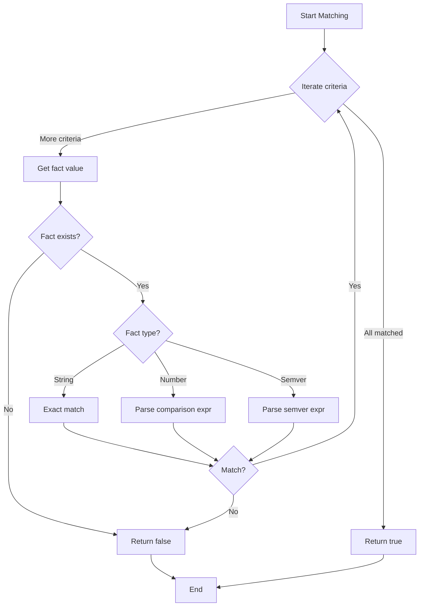

# FactForge Specification

> **Navigation**: [Overview](./README.md) | [Specification](./SPEC.md) | [Architecture](./ARCHITECTURE.md) | [Test Cases](./TEST-CASES.md)

## Table of Contents

- [YAML Schema](#yaml-schema)
- [Fact System](#fact-system)
- [Templating](#templating)
- [Variant System](#variant-system)
- [Action System](#action-system)
- [Verification](#verification)
- [Path Validation](#path-validation)
- [Idempotency](#idempotency)
- [Saved Facts](#saved-facts)

## YAML Schema

### Top-Level Structure

```yaml
# Optional: Override default saved facts location
save_facts_to: ~/.cache/myconfig/facts.json

# Required: Fact declarations
facts:
  - ...

# Required: Step definitions
steps:
  - ...
```

### Fact Declarations

#### Intrinsic Facts

```yaml
facts:
  - name: os           # Creates fact "os"
    type: intrinsic    # Values: "linux", "macos", "windows"
    
  - name: arch         # Creates fact "arch"
    type: intrinsic    # Values: "x86_64", "arm64"
    
  - name: user         # Creates fact "user"
    type: intrinsic    # Current username
    
  - name: uid          # Creates fact "uid"
    type: intrinsic    # Current user ID (number)
    
  - name: factforge_version  # Creates fact "factforge_version"
    type: intrinsic    # FactForge binary version (semver)
```

#### Environment Facts

```yaml
facts:
  - name: home         # Creates fact "home"
    type: env          # Reads $HOME
    
  - name: shell        # Creates fact "shell"
    type: env          # Reads $SHELL
    variable: SHELL    # Optional: explicit var name (default: uses fact name)
```

#### Command Facts

```yaml
facts:
  - name: has_brew     # Creates facts: has_brew.stdout, has_brew.stderr, has_brew.status
    type: command
    run: "which brew"  # Executed via /bin/sh -c
    output: status     # Which output to expose as primary fact value (optional)
                       # Options: stdout (default), stderr, status
    as: number         # Type conversion (optional)
                       # Options: string (default), number, semver
    
  - name: node_version # Creates facts: node_version.stdout, node_version.stderr, node_version.status
    type: command
    run: "node --version"
    output: stdout
    as: semver         # Parses "v18.0.0" or "18.0.0" as semantic version
```

**Command Fact Outputs**:

All command facts create three sub-facts automatically:
- `<name>.stdout`: Command's stdout (trimmed)
- `<name>.stderr`: Command's stderr (trimmed)
- `<name>.status`: Exit code (number)

The `output` field selects which one is the primary value accessible via `{{fact_name}}`.

**Type Conversions**:

- `string`: Raw string output (trimmed)
- `number`: Parsed as integer or float
- `semver`: Parsed as semantic version (major.minor.patch)

### Step Definitions

```yaml
steps:
  - name: install_tool     # Required: unique step identifier
    needs:                 # Optional: dependencies (list of step names)
      - install_homebrew
    variants:              # Required: at least one variant
      - when:              # Required: matching criteria
          os: macos
          arch: arm64
        actions:           # Required: list of actions
          - type: download
            url: "https://example.com/tool-{{arch}}"
            dest: "${HOME}/bin/tool"
          - type: shell
            run: "chmod +x ${HOME}/bin/tool"
      - when:
          os: linux
        actions:
          - type: shell
            run: "apt-get install -y tool"
```

**Step Name Validation**:
- Must be unique within the config
- Recommended: alphanumeric + underscore (`install_tool`, `setup_rust`)
- Must not be empty

### Variant Matching Criteria

The `when` clause uses AND logic - all specified criteria must match:

```yaml
when:
  os: macos           # Matches if os == "macos"
  arch: arm64         # AND arch == "arm64"
  has_brew: 0         # AND has_brew (status) == 0
```

**Matching Rules**:
- **Strings**: Always exact match (case-sensitive)
- **Numbers**: Support comparison operators (`<`, `<=`, `>`, `>=`, `==`) or shorthand equality
- **Semvers**: Support comparison operators OR caret (`^`) / tilde (`~`) notation
- Missing facts in criteria = false (variant doesn't match)
- **No variant matches**: Warning issued, step skipped (not an error)
- **Multiple variants match**: Fatal error (must be exactly one)

**Semver Comparison**:

For semver-typed facts, special matching syntax:

```yaml
when:
  node_version: ">=18.0.0"    # Matches if node_version >= 18.0.0
  node_version: "^18.0.0"      # Matches compatible version (^18.0.0)
  node_version: "~18.0.0"       # Matches approximate version (~18.0.0)
```

## Fact System

### Fact Collection Order

Facts are collected in declaration order:
1. All intrinsic facts (fast, no I/O)
2. All environment facts (fast, no I/O)
3. Command facts in declaration order (each runs once, cached)

### Fact Caching

- Intrinsic and env facts: Computed once at startup
- Command facts: Computed once, cached for duration of run
- Facts are NOT cached across runs (except via saved facts file)

### Fact Name Resolution

Facts are accessed by name in templates:
- `{{os}}` - primary value of "os" fact
- `{{has_brew}}` - primary value (status, since output: status)
- `{{has_brew.stdout}}` - explicit sub-fact access
- `{{has_brew.status}}` - explicit status access

### Reserved Fact Names

These names are provided automatically and cannot be redeclared:
- `os`, `arch`, `user`, `uid`, `factforge_version`

## Templating

### Syntax

**Fact Interpolation** (GitHub Actions style):
```yaml
url: "https://example.com/tool-{{arch}}-{{os}}"
dest: "${HOME}/bin/my-tool-{{factforge_version}}"
```

**Environment Variable Interpolation** (Shell style):
```yaml
dest: "${HOME}/bin/tool"
dest: "${XDG_CONFIG_HOME}/myapp/config"
```

### Resolution Rules

1. First, resolve `${ENV}` patterns (environment variables)
2. Then, resolve `{{fact}}` patterns (fact values)
3. Undefined facts or env vars cause an error

### Escaping

To use literal braces in templates:
```yaml
# Use double braces to escape
run: "echo '{{'{{' }}arch{{'}}'}}'"  # Outputs: {{arch}}
```

### Template Context

Templates can be used in:
- Action `url` fields
- Action `dest` fields
- Action `run` fields (shell commands)
- Action `path` fields (write_file)
- Action `content` fields (write_file)

## Variant System

### Matching Behavior

Every step must match **zero or one** variant:

```yaml
steps:
  - name: install_ripgrep
    variants:
      - when: { os: macos, has_brew: 0 }
        actions: [...]
      - when: { os: linux, has_apt: 0 }
        actions: [...]
      # On macOS without brew: no match → warning, step skipped
      # On macOS with brew AND apt: multiple matches → ERROR
```

**Matching Rules**:
- **Zero matches**: Step is skipped with a warning (not an error)
  - Useful for platform-specific tools that don't apply everywhere
  - Report shows step as "skipped (no matching variant)"
- **One match**: Execute that variant's actions normally
- **Multiple matches**: Fatal error (exit code 3)
  - Configuration must be unambiguous
  - Forces explicit, deterministic matching

### Variant Selection Algorithm

```
for each step in dependency_order:
    matches = []
    for each variant in step.variants:
        if variant.when matches all facts:
            matches.append(variant)
    
    if matches.len() == 0:
        warn("Step '{}' has no matching variant, skipping", step.name)
        report.add_skipped(step.name, "no matching variant")
        continue
    if matches.len() > 1:
        return Error(ExitCode::MultipleMatchingVariants)
    
    execute(matches[0].actions)
```

### Matching Logic



### Comparison Expression Parsing

**Number Expressions**:
- `"42"` or `"==42"` → equality
- `"<10"` → less than 10
- `"<=100"` → less than or equal 100
- `">5"` → greater than 5
- `">=0"` → greater than or equal 0

**Semver Expressions**:
- `"1.2.3"` or `"==1.2.3"` → exact version
- `"<2.0.0"` → less than 2.0.0
- `"<=1.5.0"` → less than or equal 1.5.0
- `">1.0.0"` → greater than 1.0.0
- `">=1.2.0"` → greater than or equal 1.2.0
- `"^1.2.3"` → compatible with 1.2.3 (major version locked)
- `"~1.2.3"` → approximately 1.2.3 (minor version locked)
for each step in dependency_order:
    matches = []
    for each variant in step.variants:
        if variant.when matches all facts:
            matches.append(variant)
    
    if matches.len() == 0:
        warn("Step '{}' has no matching variant, skipping", step.name)
        report.add_skipped(step.name, "no matching variant")
        continue
    if matches.len() > 1:
        return Error(ExitCode::MultipleMatchingVariants)
    
    execute(matches[0].actions)
```

### Matching Semantics

**Exact Match** (strings):
```yaml
when:
  os: macos    # Matches only if os == "macos"
```

**Number Match** (shorthand equality):
```yaml
when:
  count: 42         # Shorthand for "==42"
  count: "==42"     # Explicit equality
  count: ">5"       # Greater than
  count: ">=10"    # Greater than or equal
  count: "<100"     # Less than
  count: "<=50"     # Less than or equal
```

**Semver Match**:
```yaml
when:
  version: ">=1.0.0"   # Greater than or equal
  version: ">2.0.0"     # Greater than
  version: "<=3.0.0"    # Less than or equal
  version: "<4.0.0"      # Less than
  version: "==1.2.3"    # Explicit equality
  version: "1.2.3"       # Shorthand equality
  version: "^1.2.3"      # Compatible (caret)
  version: "~1.2.3"      # Approximate (tilde)
```

**Multiple Criteria** (AND logic):
```yaml
when:
  os: macos
  arch: arm64         # Matches only if BOTH are true
  node_version: ">=18.0.0"  # AND version >= 18.0.0
```

## Action System

### Common Action Fields

All actions support:
```yaml
actions:
  - type: <action_type>
    idempotent: true        # Optional: override default idempotency check
    condition: "{{os}}"      # Optional: skip if evaluates to empty/false
```

### Download Action

```yaml
actions:
  - type: download
    url: "https://example.com/tool-{{arch}}"    # Required: URL template
    dest: "${HOME}/bin/tool"                      # Required: destination path
    verify:                                       # Optional: verification
      sha256: "abc123..."                         # Required if verify present: SHA256 checksum
      gpg: "ABCD1234..."                          # Optional: GPG key ID for verification
    headers:                                      # Optional: HTTP headers
      Authorization: "Bearer {{token}}"
    idempotent: true                              # Default: checks if file exists with correct hash
```

**Idempotency Check**:
- If file exists at `dest` and SHA256 matches → skip (success)
- If file exists but SHA256 differs → re-download
- If no SHA256 provided → check file exists only

**Verification** (following [checksy](https://github.com/notwillk/checksy) pattern):
1. Download to temporary location
2. Verify SHA256 (if provided)
3. Verify GPG signature (if provided)
4. Move to final destination (atomic)

### Shell Action

```yaml
actions:
  - type: shell
    run: "brew install ripgrep"           # Required: shell command
    cwd: "${HOME}/projects"                # Optional: working directory (default: current)
    env:                                   # Optional: additional env vars
      PATH: "${HOME}/bin:${PATH}"
    idempotent: false                      # Default: always runs
```

**Idempotency Check**:
- Default: `false` (shell commands always run)
- Override with `idempotent: true` and `condition:`
- Recommended: Use shell commands that are inherently idempotent

### Extract Action

```yaml
actions:
  - type: extract
    src: "${HOME}/downloads/tool.tar.gz"   # Required: archive path
    dest: "${HOME}/bin"                     # Required: extraction directory
    strip_components: 1                     # Optional: remove leading path components (tar only)
    idempotent: true                        # Default: checks if dest files exist
```

**Supported Formats**:
- `.tar`, `.tar.gz`, `.tgz`, `.tar.bz2`, `.tar.xz`
- `.zip`

**Idempotency Check**:
- If destination files exist → skip
- Override with `idempotent: false` to force re-extraction

### Write File Action

```yaml
actions:
  - type: write_file
    path: "${HOME}/.config/myapp/config.toml"   # Required: file path
    content: |                                     # Required: file content (supports templates)
      [settings]
      os = "{{os}}"
      arch = "{{arch}}"
    mode: "0600"                                 # Optional: file permissions (octal)
    idempotent: true                              # Default: checks if content matches
```

**Idempotency Check**:
- If file exists and content matches exactly → skip
- If file exists but content differs → overwrite
- If `mode` specified and differs → chmod

## Verification

### SHA256 Verification

Checksum format: 64-character hex string (case insensitive)

```yaml
verify:
  sha256: "e3b0c44298fc1c149afbf4c8996fb92427ae41e4649b934ca495991b7852b855"
```

Verification process:
1. Download to temp file
2. Compute SHA256 of downloaded file
3. Compare with provided checksum
4. If mismatch: delete temp file, return ExitCode::ChecksumFailed

### GPG Verification

```yaml
verify:
  sha256: "abc123..."              # Required: SHA256 must also be provided
  gpg: "ABCD1234..."               # GPG key ID (short or long form)
```

Verification process:
1. Download file and detached signature (`.sig` or `.asc`)
2. Verify signature with specified key
3. Also verify SHA256
4. If GPG fails: return ExitCode::GPGFailed

**Signature URL Convention**:
- If file URL is `https://example.com/tool.tar.gz`
- Signature expected at `https://example.com/tool.tar.gz.sig`

## Path Validation

### Protected Paths

By default, FactForge prevents writes to system directories:
- `/usr/*` (except `/usr/local` if user-owned)
- `/bin`, `/sbin`, `/lib`, `/lib64`
- `/etc` (except user-owned files)
- `/opt`
- `/var`
- Any path not under `${HOME}` or `/tmp`

### Validation Rules

Allowed paths (without `--allow-system-paths`):
- `${HOME}/` and subdirectories
- `/tmp/` and subdirectories
- User-writable directories (checked at runtime)

### Override

```bash
# DANGER: Allow system paths (requires explicit flag)
factforge run --allow-system-paths config.yaml
```

When `--allow-system-paths` is used:
- A warning is displayed
- Normal execution proceeds

## Idempotency

### Action Defaults

| Action | Default Idempotent | Check Method |
|--------|-------------------|--------------|
| download | true | File exists + SHA256 match |
| shell | false | Always runs |
| extract | true | Destination files exist |
| write_file | true | File exists + content match |

### Override

```yaml
actions:
  - type: shell
    run: "brew install ripgrep"
    idempotent: true          # Force idempotency (runs only if condition true)
    condition: "{{needs_install}}"  # Custom condition
```

### Shell Idempotency Patterns

For inherently idempotent operations:
```yaml
# Good: Idempotent by design
- type: shell
  run: "mkdir -p ${HOME}/bin"

# Good: Tool handles idempotency
- type: shell
  run: "brew install ripgrep"  # brew is idempotent

# Requires explicit check
- type: shell
  run: "cargo install ripgrep"
  idempotent: true
  condition: "{{ripgrep_not_installed}}"  # Custom fact
```

## Saved Facts

### Storage Format

```json
{
  "config_path": "/absolute/path/to/config.yaml",
  "saved_at": "2024-01-15T10:30:00Z",
  "factforge_version": "1.0.0",
  "facts": {
    "os": "macos",
    "arch": "arm64",
    "user": "alice",
    "uid": 501,
    "home": "/Users/alice",
    "has_brew": 0,
    "node_version": "20.0.0",
    "has_brew.stdout": "/opt/homebrew/bin/brew",
    "has_brew.stderr": "",
    "has_brew.status": 0,
    "node_version.stdout": "v20.0.0",
    "node_version.stderr": "",
    "node_version.status": 0
  }
}
```

### Storage Location

**Default**: `~/.local/share/factforge/saved/<config_path_hash>.json`

Where `<config_path_hash>` is SHA256 of the absolute config file path.

**Override in YAML**:
```yaml
save_facts_to: ~/.cache/factforge/myconfig.json
```

If `save_facts_to` is a relative path, it's resolved relative to the config file directory.

### Check Command

Compares saved facts with current facts:

```bash
# Interactive mode
$ factforge check config.yaml
Facts changed since 2024-01-15:
  - os: linux → macos
  - node_version: 18.0.0 → 20.0.0

Rerun with new facts? [Y/n]

# Warning only
$ factforge check --warn-only config.yaml
WARNING: Facts have changed. Consider running:
  factforge run config.yaml

# JSON output
$ factforge check --json config.yaml
{
  "changed": true,
  "facts": [...]
}
```

---

*See also: [Overview](./README.md), [Architecture](./ARCHITECTURE.md), [Test Cases](./TEST-CASES.md)*

---

*Document Version: 1.0*  
*Part of the [FactForge Product Requirements](./README.md)*
