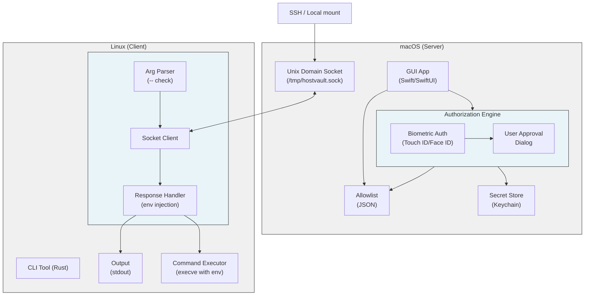
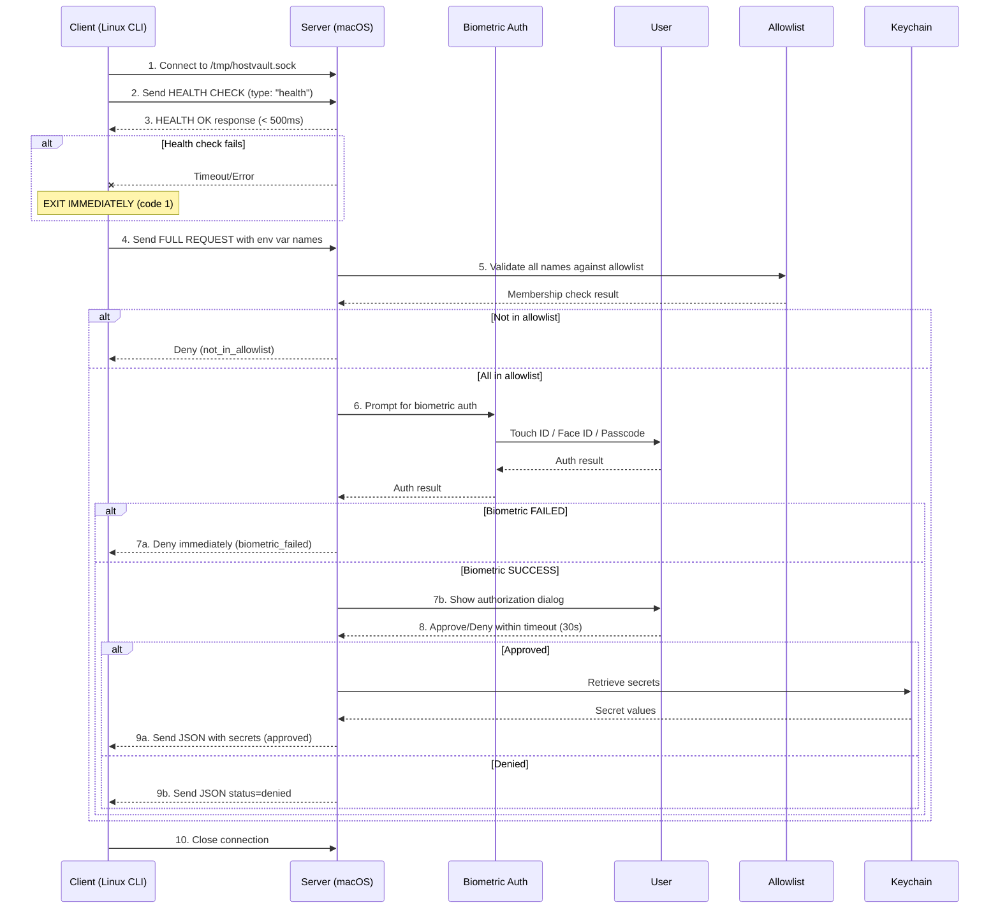

# HostVault - Product Requirements Document

## 1. Overview

The **HostVault** is a secure environment variable distribution system consisting of:
- **Server**: A macOS GUI application that stores sensitive environment variables, enforces a strict allowlist of accessible env var names, and requires biometric authentication (Touch ID / Face ID / Passcode) before authorizing access requests
- **Client**: A Linux CLI tool (ARM/x86) that requests environment variables from the server and can execute commands with those env vars set (following the `env` tool pattern with `--` separator)

The system uses a Unix domain socket for communication and implements a multi-layer security model:
1. **Allowlist Enforcement**: Only env var names explicitly configured in the server's allowlist can be requested - all others are blocked by default
2. **Biometric Authentication**: Touch ID, Face ID, or device passcode is mandatory for ALL authorization decisions
3. **Explicit Authorization**: User must approve each request after biometric authentication

**CLI Usage Patterns**:
- **Execution Mode**: `hv ENV1 ENV2 -- command-to-run` - Requests env vars and executes the command with those vars set
- **Inspection Mode**: `hv ENV1 ENV2` - Requests env vars and outputs them (requires same auth flow, but no command execution)

This design ensures that even if a client is compromised, only pre-approved env var names can be targeted, and even then, the attacker's requests will be blocked without physical biometric verification from the user.

---

## 2. Goals & Objectives

### 2.1 Primary Goals
1. **Secure Secret Storage**: Store sensitive environment variables securely on macOS
2. **Explicit Authorization**: Require user approval for every secret access request
3. **Cross-Platform Support**: Server on macOS, client on Linux (ARM64/x86_64)
4. **Minimal Attack Surface**: Unix domain socket communication only (no network exposure)
5. **Audit Trail**: Log all authorization decisions with timestamps

### 2.2 Success Criteria
- [ ] Server runs as native macOS app with menu bar/system tray integration
- [ ] Server has configuration panel to define which env var names are in the allowlist
- [ ] Only env var names in the allowlist can be accessed; all others are automatically blocked
- [ ] Touch ID / Face ID / Passcode required for ALL authorization decisions
- [ ] Client successfully connects via Unix domain socket
- [ ] All secret requests trigger GUI authorization dialog with mandatory biometric auth
- [ ] Secrets are never transmitted without explicit user approval + biometric verification
- [ ] Client receives appropriate status codes for denied/approved requests (including allowlist violations)
- [ ] Support for multiple concurrent client connections
- [ ] Secrets are encrypted at rest in macOS Keychain
- [ ] Server GUI collects access logs including successful requests, failed attempts, and authentication failures
- [ ] Server GUI provides ability to view and purge access logs with date range filtering

---

## 3. System Architecture

### 3.1 High-Level Diagram



**Exit Codes:**
- `0`: Success (secrets printed or cmd exited 0)
- `1`: Connection error
- `2`: Authorization denied
- `3`: Timeout
- `4`: Secret not found
- `8`: Not in allowlist
- `9`: Biometric failed
- `10`: Command not found
- `11`: Command failed

### 3.2 Component Breakdown

#### 3.2.1 Server (macOS)
- **Platform**: macOS 10.15+ (Catalina and later) for Touch ID support
- **Language**: Swift with SwiftUI for GUI
- **Socket Path**: `/tmp/hostvault.sock` (configurable)
- **Allowlist Storage**: JSON file (`~/Library/Application Support/HostVault/`)
- **Secret Storage**: macOS Keychain for secret values (keyed by env var name)
- **Biometric Auth**: LocalAuthentication framework (Touch ID / Face ID / Passcode)
- **Health Endpoint**: Simple ping/pong endpoint for availability checks (no auth, <100ms response)
- **GUI**: Menu bar app with configuration panel and authorization dialogs

**Core Components**:
1. **Allowlist Manager**: Maintains list of permitted env var names; all requests filtered against this list
2. **Biometric Auth Engine**: Handles Touch ID / Face ID / Passcode prompts using LocalAuthentication
3. **Authorization Dialog**: GUI shown only after successful biometric authentication
4. **Socket Handler**: Manages Unix domain socket connections and JSON protocol
5. **Secret Store**: macOS Keychain wrapper for encrypted secret value storage
6. **Health Handler**: Fast endpoint that responds immediately without auth checks (used for client pre-flight)

#### 3.2.2 Client (Linux)
- **Platforms**: Linux & macos (ARM64, x86_64)
- **Language**: Rust (preferred) or Go
- **Architecture**: Single static binary for easy deployment
- **Dependencies**: Minimal (libc only)

---

## 4. Communication Protocol

### 4.1 Socket Protocol Specification

**Transport**: Unix Domain Stream Socket  
**Serialization**: JSON (newline-delimited)  
**Encoding**: UTF-8

### 4.1.1 Health Check Endpoint

Before making a full secret request, the client **MUST** send a lightweight health check to verify server availability.

**Health Check Request**:
```json
{
  "version": "1.0",
  "type": "health",
  "timestamp": "ISO8601-string",
  "request_id": "uuid-v4-string"
}
```

**Health Check Response** (expected within 500ms):
```json
{
  "version": "1.0",
  "type": "health",
  "status": "ok",
  "timestamp": "ISO8601-string",
  "server_version": "1.0.0",
  "capabilities": ["biometric_auth", "allowlist"]
}
```

**Server Health Check Behavior**:
- Response must be returned within 100ms (no biometric/auth required)
- Simple "ping/pong" - just confirms server is running and responsive
- No auth, no allowlist checks, no logging (minimal overhead)

### 4.2 Message Types

#### 4.2.1 Client → Server

**Request Format**:
```json
{
  "version": "1.0",
  "request_id": "uuid-v4-string",
  "timestamp": "ISO8601-string",
  "client_info": {
    "hostname": "client-hostname",
    "user": "client-username",
    "pid": 12345,
    "cwd": "/current/working/dir"
  },
  "secrets": ["SECRET_NAME_1", "SECRET_NAME_2", "API_KEY_PROD"]
}
```

#### 4.2.2 Server → Client

**Success Response**:
```json
{
  "version": "1.0",
  "request_id": "uuid-v4-string",
  "status": "approved",
  "timestamp": "ISO8601-string",
  "secrets": {
    "SECRET_NAME_1": "secret-value-1",
    "SECRET_NAME_2": "secret-value-2"
  }
}
```

**Denial Response**:
```json
{
  "version": "1.0",
  "request_id": "uuid-v4-string",
  "status": "denied",
  "timestamp": "ISO8601-string",
  "reason": "user_denied|timeout|invalid_request|secret_not_found|not_in_allowlist|biometric_failed"
}
```

**Partial Success Response** (when some secrets are in allowlist, others are not):
```json
{
  "version": "1.0",
  "request_id": "uuid-v4-string",
  "status": "partial",
  "timestamp": "ISO8601-string",
  "secrets": {
    "API_KEY_PROD": "secret-value-1"
  },
  "blocked": ["UNAUTHORIZED_VAR"],
  "message": "1 secret(s) blocked - not in allowlist"
}
```

### 4.3 Protocol Flow



**Request Processing Flow**:
1. **Health Check**: Client sends health check, waits max 500ms for response
   - **Success**: Continue to full request
   - **Timeout/Failure**: Short-circuit with exit code 1 (server unreachable)
2. **Allowlist Check**: Server checks each requested env var name against the configured allowlist
   - If ALL names are in allowlist: proceed to biometric auth
   - If ANY name is NOT in allowlist: request is partially or fully denied (exit code 8)
3. **Biometric Authentication**: LocalAuthentication framework prompt
   - Success: Continue to authorization dialog
   - Failure/Cancel: Immediate denial (exit code 9)
4. **User Authorization**: Dialog shown with client details and request info
5. **Secret Retrieval**: If approved, values fetched from Keychain and sent to client

---

## 5. Server (macOS GUI App) Specifications

### 5.1 Core Features

#### 5.1.1 Secret Management (Allowlist Model)
The server operates on a strict **allowlist model** where ONLY explicitly configured environment variable names can be accessed. All other requests are automatically blocked.

**Configuration Panel Features**:
- **Define Available Env Vars**: Create and manage the list of allowed environment variable names that clients may request
- **Set Secret Values**: For each env var name, store its corresponding secret value in macOS Keychain
- **Add by Existing Env Var**: Auto-detect and add environment variable names currently set in the shell (e.g., scan `env` and pick keys to expose)
- **Allowlist Enforcement**: Server maintains a strict allowlist; any client request for env vars NOT in this list is automatically denied with `not_in_allowlist` reason
- **Edit Secret**: Modify secret values for existing allowed env var names
- **Delete Secret**: Remove env var names from allowlist and delete their values
- **View Allowlist**: Display all configured env var names (secret values masked)
- **Import/Export**: JSON format for backup/restore of allowlist and values

#### 5.1.2 Authorization Flow with Biometric Authentication

**Mandatory Biometric Authentication**:
All authorization decisions MUST be authenticated via Touch ID, Face ID, or device passcode. No "Approve" buttons without biometric verification.

**Authorization Flow**:
1. Client connects and sends request for env var names
2. Server validates that ALL requested names are in the allowlist (any non-allowlist request is immediately denied)
3. Server prompts for biometric authentication (Touch ID / Face ID / Passcode)
4. Upon successful biometric auth, authorization dialog is displayed showing request details
5. User can then approve or deny the request
6. Denied biometric auth immediately denies the request

**Authorization Dialog Requirements** (shown only after successful biometric auth):
- Modal window showing:
  - 🔒 "Authenticated via Touch ID" badge
  - Client hostname, user, PID, and CWD
  - List of requested env var names (from allowlist)
  - Warning if any non-allowlist secrets were requested (already filtered out)
  - "Approve Once" button (requires biometric re-auth on next request)
  - "Approve Always for this Client" button (stores client in biometric-bypass whitelist for 1 hour)
  - "Deny" button
  - 30-second timeout with countdown timer
  - Checkbox for "Remember this decision (still requires biometric auth)"

#### 5.1.3 Health Check Endpoint

The server exposes a simple health check endpoint for client pre-flight checks:

**Endpoint**: Same socket, message type `"health"`
**Response Time**: Must respond within 100ms
**Authentication**: None required
**Logging**: No audit log entry (reduces noise)
**Rate Limiting**: 10 requests/second per connection

**Purpose**: Allow CLI to quickly determine if server is available before attempting full auth flow. This prevents user confusion (waiting for Touch ID when server is down).

#### 5.1.4 Whitelist/Blacklist
- **Per-Client Whitelist**: Remember approved clients by hostname+user hash
- **Per-Secret Rules**: Restrict which clients can request specific secrets
- **Time-Based Rules**: Expire whitelist entries after configurable duration

### 5.2 UI/UX Design

#### 5.2.1 Menu Bar App
- Lives in macOS menu bar (system tray)
- Dropdown menu with:
  - "Manage Secrets" → Opens management window
  - "View Logs" → Opens audit log viewer
  - "Settings" → Opens preferences
  - "Quit" → Exit application

#### 5.2.1a Access Log Management
The server GUI must provide comprehensive access log collection and management:

**Log Collection Requirements**:
- Collect all access attempts including successful and **failed attempts**
- Log entries must include: timestamp, client hostname, client user, PID, requested env vars, decision (approved/denied), reason for denial, and biometric auth status
- Failed authentication attempts (biometric failure, timeout, allowlist violations) must be explicitly logged
- Logs stored locally in JSON Lines format with rotation support

**Log Purge Capabilities**:
- GUI must provide ability to purge logs by date range (e.g., "older than 30 days")
- Option to purge all logs with confirmation dialog
- Purge operation must be logged itself for audit trail completeness
- Export logs before purge (optional but recommended)

#### 5.2.2 Secret Configuration Panel (Allowlist Management)
```
┌─────────────────────────────────────────────────────────────────────────────┐
│ HostVault - Configure Env Vars                                 [+] [-]  │
├─────────────────────────────────────────────────────────────────────────────┤
│                                                                             │
│  ┌─ Allowlist Configuration ──────────────────────────────────────────┐    │
│  │                                                                     │    │
│  │  Only env var names listed below can be requested by clients.       │    │
│  │  All other requests will be automatically blocked.                 │    │
│  │                                                                     │    │
│  │  [🔍 Import from Environment...]  [📁 Import from File...]         │    │
│  │                                                                     │    │
│  └─────────────────────────────────────────────────────────────────────┘    │
│                                                                             │
│  ┌─ Allowed Env Var Names ──────────────────────────────────────────────┐   │
│  │                                                                       │   │
│  │ Env Var Name        │ Secret Set │ Last Access │ Actions              │   │
│  ├───────────────────────────────────────────────────────────────────────┤   │
│  │ API_KEY_PROD        │ ✅ Yes     │ 2 hours ago │ [👁 View] [🗑 Del]   │   │
│  │ DATABASE_URL        │ ✅ Yes     │ 1 day ago   │ [👁 View] [🗑 Del]   │   │
│  │ GITHUB_TOKEN        │ ⚠️ Empty   │ Never       │ [✏ Set] [🗑 Del]    │   │
│  │ AWS_ACCESS_KEY      │ ✅ Yes     │ 3 days ago  │ [👁 View] [🗑 Del]   │   │
│  │ STRIPE_SECRET_KEY   │ ✅ Yes     │ Never       │ [👁 View] [🗑 Del]   │   │
│  │                                                                     │   │
│  └───────────────────────────────────────────────────────────────────────┘   │
│                                                                             │
│  Total: 6 env vars configured  │  5 with secrets set  │  1 empty              │
└─────────────────────────────────────────────────────────────────────────────┘
```

#### 5.2.3 Authorization Dialog with Biometric Auth

**Step 1: Biometric Authentication Prompt**
```
┌────────────────────────────────────────────────────────────┐
│ 🔐 Authentication Required                                  │
├────────────────────────────────────────────────────────────┤
│                                                            │
│     ┌─────────────┐                                        │
│     │             │                                        │
│     │   🔐 Touch   │                                        │
│     │    ID       │                                        │
│     │             │                                        │
│     └─────────────┘                                        │
│                                                            │
│  A client is requesting access to environment variables.   │
│                                                            │
│  Please authenticate to view and authorize this request.     │
│                                                            │
│  [  Use Passcode Instead  ]                                │
│                                                            │
└────────────────────────────────────────────────────────────┘
```

**Step 2: Authorization Dialog (after biometric success)**
```
┌────────────────────────────────────────────────────────────┐
│ ✅ Authenticated via Touch ID    Secret Access    00:27    │
├────────────────────────────────────────────────────────────┤
│                                                            │
│  A client is requesting access to the following env vars:    │
│                                                            │
│  ┌─────────────────────────────────────────────────────┐   │
│  │ ✅ API_KEY_PROD      (allowed - in allowlist)      │   │
│  │ ✅ DATABASE_URL      (allowed - in allowlist)      │   │
│  │ ❌ UNAUTHORIZED_VAR  (BLOCKED - not in allowlist) │   │
│  └─────────────────────────────────────────────────────┘   │
│                                                            │
│  Client Details:                                           │
│    Host: dev-server-01.company.local                       │
│    User: deploybot                                         │
│    PID:  48291                                             │
│    CWD:  /opt/app/deployment                               │
│                                                            │
│  [  ] Remember this client (still requires biometric)   │
│                                                            │
│      [  👍  Approve  ]  [  👎  Deny  ]                   │
│                                                            │
│  Note: Approval valid for this request only.              │
│        Biometric auth required for all secret requests.     │
└────────────────────────────────────────────────────────────┘
```

### 5.3 Configuration

**Settings Window**:
- **Socket Path**: Default `/tmp/hostvault.sock`
- **Authorization Timeout**: Default 30 seconds
- **Auto-Start**: Launch at login option
- **Logging Level**: Debug/Info/Warning/Error
- **Whitelist Duration**: How long to remember approved clients (default: 24 hours)
- **Theme**: Light/Dark/System

### 5.4 Audit Logging

**Log Format** (JSON Lines):
```json
{
  "timestamp": "2024-01-15T09:23:45.123Z",
  "event": "authorization_request",
  "request_id": "550e8400-e29b-41d4-a716-446655440000",
  "client": {
    "hostname": "dev-server-01",
    "user": "deploybot",
    "pid": 48291
  },
  "secrets_requested": ["API_KEY_PROD", "DATABASE_URL"],
  "decision": "approved",
  "decision_by": "user",
  "duration_ms": 3200
}
```

**Log Events**:
- `server_start` / `server_stop`
- `client_connected` / `client_disconnected`
- `authorization_request`
- `authorization_approved` / `authorization_denied`
- `secret_accessed`
- `error`
- `authentication_failed` (biometric failure, timeout, or passcode failure)
- `allowlist_violation` (attempt to access non-allowlisted env var)
- `log_purged` (when admin purges logs)

---

## 6. Client (Linux CLI) Specifications

### 6.1 Command-Line Interface

#### 6.1.1 Connection Flow: Health Check First

Before any secret request, the CLI **MUST** perform a health check to verify server availability:

1. **Connect to socket** (`/tmp/hostvault.sock`)
2. **Send health check request** (type: "health")
3. **Wait for health OK response** (timeout: 500ms)
   - **If healthy**: Continue with full secret request + auth flow
   - **If timeout/no response**: **SHORT-CIRCUIT** with exit code 1 (connection error)
   - **If error response**: Exit with appropriate error code

This prevents waiting for the full biometric authorization flow if the server is down or unresponsive.

#### 6.1.2 Execution Pattern (with `--`)

The CLI follows the `env` tool pattern. When `--` is provided, the CLI:
1. **Health check** (short-circuit if server unavailable)
2. Connects to the server and requests the specified env vars
3. Waits for biometric authorization
4. Sets the retrieved values as environment variables
5. Executes the command after `--` with those env vars available

```bash
# Execute command with env vars set
hv API_KEY_PROD DATABASE_URL -- node server.js
hv AWS_ACCESS_KEY AWS_SECRET_KEY -- terraform apply
hv DATABASE_URL -- psql $DATABASE_URL

# Multiple flags/args after --
hv API_KEY -- curl -H "Authorization: Bearer $API_KEY" https://api.example.com/data

# Complex commands
hv STRIPE_KEY GITHUB_TOKEN -- bash -c 'echo "Stripe: $STRIPE_KEY" && git push'
```

#### 6.1.3 Inspection Mode (no `--`)

If no `--` is given, the CLI only **requests** the env vars if they exist in the server's allowlist and are configured with values. The auth flow still happens (biometric approval required), but no command is executed.

```bash
# Just request and output env vars (if allowed and set)
hv API_KEY_PROD DATABASE_URL

# With socket path
hv --socket /custom/path.sock API_KEY_PROD

# Output formats (only meaningful without --)
hv --format env API_KEY_PROD DATABASE_URL
# Output: export API_KEY_PROD="value1"
#         export DATABASE_URL="value2"

hv --format json API_KEY_PROD
# Output: {"API_KEY_PROD": "value1"}

hv --format plain API_KEY_PROD
# Output: value1 (first secret only)

# Check server status (health check only)
hv --status
# Output: Server is running (version 1.0.0)
# Or: Error: Server not responding (timeout 500ms)

# Show version
hv --version
```

#### 6.1.4 CLI Options and Arguments

**Usage:**
```
hv [OPTIONS] ENV1 [ENV2 ENV3 ...] [-- COMMAND [ARGS...]]
```

**Options:**

| Option | Description | Default |
|--------|-------------|---------|
| `--socket <PATH>` | Path to the Unix domain socket file | `/tmp/hostvault.sock` |
| `--format <FORMAT>` | Output format: `export`, `env`, `json`, `plain` | `export` |
| `--status` | Check server health and exit | - |
| `--version` | Show version information and exit | - |
| `-h, --help` | Show help message and exit | - |

**Socket Path Resolution:**

The socket path is resolved in the following priority order:
1. `--socket` CLI flag (highest priority)
2. `SECRETCLI_SOCKET` environment variable
3. `socket_path` in config file (`~/.config/hv/config.yaml`)
4. Default: `/tmp/hostvault.sock`

**Examples:**

```bash
# Use custom socket path
hv --socket /var/run/hv.sock API_KEY_PROD -- node app.js

# Socket path via environment variable
export SECRETCLI_SOCKET=/custom/path.sock
hv API_KEY_PROD DATABASE_URL

# Check server status with custom socket
hv --socket /tmp/custom.sock --status
```

#### 6.1.5 Shell Integration
```bash
# Source the exports into current shell (inspection mode)
eval $(hv --format export API_KEY_PROD DATABASE_URL)
# Output suitable for eval: export API_KEY_PROD="value1"; export DATABASE_URL="value2"

# Use in subshell
(hv API_KEY -- ./script.sh)
# Env vars only available within the subshell

# Chain multiple secrets
hv SECRET1 -- hv SECRET2 -- ./app
# Each requires separate biometric approval (by design)
```

### 6.2 Exit Codes

| Code | Meaning | Description |
|------|---------|-------------|
| `0` | Success | Secrets retrieved and output to stdout, or command executed successfully |
| `1` | Connection Error | Health check failed, cannot connect to server, or socket not found |
| `2` | Authorization Denied | User explicitly denied the request or biometric auth failed |
| `3` | Timeout | Authorization dialog timed out |
| `4` | Secret Not Found | One or more requested secrets don't exist in allowlist or have no value set |
| `5` | Invalid Request | Malformed request or invalid secret name format |
| `6` | Protocol Mismatch | Version mismatch between client and server |
| `7` | Permission Denied | Client lacks permission to access socket |
| `8` | Not In Allowlist | Requested env var(s) not in server's configured allowlist |
| `9` | Biometric Failed | Biometric authentication failed or was cancelled |
| `10` | Command Not Found | The command after `--` was not found or not executable |
| `11` | Command Failed | Command executed but returned non-zero exit code |

**Health Check Short-Circuit**:
The CLI **always** performs a health check first (max 500ms). If this fails:
- **Exit code 1** is returned immediately
- **No biometric auth** is attempted
- **No command** is executed (in execution mode)
- Clear error message indicates server is unavailable

**Exit Code Rules for `-- command`**:
- Codes `1-9`: Connection/auth/validation failures (command never runs)
- Code `10`: Command after `--` not found or not executable
- Code `11`: Command executed but returned non-zero
- Otherwise: The exit code of the executed command

### 6.3 Execution Model & Argument Parsing

The CLI distinguishes between **inspection mode** and **execution mode** based on the presence of the `--` separator.

#### 6.3.1 Argument Parsing Rules

**Execution Mode (with `--`)**:
```
hv [OPTIONS] ENV1 [ENV2 ENV3 ...] -- COMMAND [ARGS...]
                                                      ^^^^ everything after -- is the command
```

- All arguments before `--` are env var names to request from the server
- All arguments after `--` form the command to execute
- `--` itself is NOT included in the command
- The command is executed with the retrieved env vars added to its environment
- Original env vars are preserved; retrieved vars are added/override

**Inspection Mode (no `--`)**:
```
hv [OPTIONS] ENV1 [ENV2 ENV3 ...]
```

- All positional arguments are env var names
- No command is executed
- Retrieved values are output to stdout in the specified format
- Still requires full auth flow (biometric + approval)

#### 6.3.2 Examples

**Execution Mode**:
```bash
# Simple command
hv API_KEY -- node app.js
# Executes: API_KEY=<secret> node app.js

# Command with arguments
hv AWS_KEY AWS_SECRET -- aws s3 ls s3://bucket
# Executes: AWS_KEY=<k> AWS_SECRET=<s> aws s3 ls s3://bucket

# Multiple env vars, complex command
hv TOKEN API_URL -- curl -H "Authorization: Bearer $TOKEN" "$API_URL/data"
# Note: Shell expands $TOKEN and $API_URL from the retrieved values

# Script with args
hv DB_URL -- ./script.sh --production --verbose
# All args after -- passed to the script
```

**Inspection Mode**:
```bash
# Output for eval
hv --format export API_KEY
# Output: export API_KEY="secret123"
# Can be used: eval $(hv --format export API_KEY)

# JSON output
hv --format json API_KEY SECRET
# Output: {"API_KEY": "val1", "SECRET": "val2"}
```

### 6.4 Configuration

**Config File**: `~/.config/hv/config.yaml`

```yaml
socket_path: /tmp/hostvault.sock
default_format: export  # export, json, plain
timeout: 30
retry:
  count: 3
  delay: 1
```

### 6.5 Error Handling

**Error Output** (stderr):

**Health Check Failures (short-circuit, no auth attempted)**:
```bash
# Server not running - health check timeout
$ hv API_KEY -- ./deploy.sh
Error: Server health check failed: Connection timeout (500ms)
         The HostVault is not responding.
         Is the HostVault running on the macOS host?
         Hint: Check the menu bar app is running and the socket exists.
(Exit code 1)

# Server running but slow/unresponsive
$ hv API_KEY -- ./deploy.sh
Error: Server health check failed: Response timeout after 500ms
         The HostVault is running but not responding to health checks.
         Try restarting the HostVault application.
(Exit code 1)

# Socket not found
$ hv API_KEY -- ./deploy.sh
Error: Server health check failed: Socket not found at /tmp/hostvault.sock
         Is the HostVault running?
         Hint: Start the HostVault from the macOS menu bar.
(Exit code 1)
```

**Inspection Mode (no `--`)**:
```bash
$ hv NON_EXISTENT_SECRET
Error: Secret not found: NON_EXISTENT_SECRET
         This env var is not in the server's allowlist or has no value set.
(Exit code 4)

$ hv API_KEY_PROD
Error: Authorization denied by user
         User declined the authorization request or cancelled biometric prompt.
(Exit code 2)

$ hv UNAUTHORIZED_SECRET
Error: Not in allowlist: UNAUTHORIZED_SECRET
         This env var name is not in the server's configured allowlist.
         Use the HostVault GUI to add it to the allowlist first.
(Exit code 8)

$ hv API_KEY_PROD
Error: Biometric authentication failed
         Touch ID/Face ID verification failed or was cancelled.
(Exit code 9)

$ hv API_KEY_PROD
Error: Connection failed: /tmp/hostvault.sock not found
Hint: Is the HostVault running on the macOS host?
(Exit code 1)
```

**Execution Mode (with `--`)**:
```bash
# Successful execution
$ hv API_KEY -- ./my-script.sh
Running with API_KEY=***... (hidden)
Script output here
(Exit code: whatever my-script.sh returned)

# Command not found
$ hv API_KEY -- nonexistent-cmd
Error: Command not found: nonexistent-cmd
         Ensure the command exists and is executable.
(Exit code 10)

# Auth denied (command never runs) - health check passed but auth failed
$ hv API_KEY -- ./deploy.sh
Error: Authorization denied by user
         Biometric prompt failed or was cancelled.
         Command './deploy.sh' was NOT executed.
(Exit code 2)

# Allowlist violation (command never runs) - health check passed but env var not in list
$ hv UNAUTHORIZED_VAR -- ./run.sh
Error: Not in allowlist: UNAUTHORIZED_VAR
         This env var name is not in the server's configured allowlist.
         Command './run.sh' was NOT executed.
(Exit code 8)

# Server stopped between health check and full request (very rare)
$ hv API_KEY -- ./deploy.sh
Error: Server disconnected during request
         The HostVault stopped responding after health check.
         Command './deploy.sh' was NOT executed.
(Exit code 1)
```

---

## 7. Security Requirements

### 7.1 Threat Model

| Threat | Mitigation |
|--------|------------|
| Unauthorized socket access | Socket file permissions (0600), socket in /tmp with owner check |
| Eavesdropping on socket | Unix domain socket (local only, no network exposure) |
| Replay attacks | Request ID uniqueness check, timestamp validation |
| Secret interception in memory | Client clears memory after use, server uses secure buffers |
| Malicious client spoofing | Client PID/hostname verification, user confirmation + biometric auth required |
| Secret storage compromise | macOS Keychain encryption, no plaintext storage |
| Unknown/unauthorized env var enumeration | Strict allowlist - only configured names accessible |
| Unauthorized approval by attacker | Touch ID / Face ID / Passcode mandatory for ALL approvals |
| Social engineering attacks | Biometric requirement prevents "just click approve" attacks |

### 7.2 Security Features

1. **Socket Security**:
   - Socket created with permissions 0600 (owner read/write only)
   - Socket ownership verified on every connection
   - Socket directory must be owned by user

2. **Request Validation**:
   - Request ID UUID v4 validation
   - Timestamp within ±5 minutes of server time (prevent replay)
   - Secret name validation (alphanumeric + underscore only)
   - Maximum 10 secrets per request

3. **Secret Storage**:
   - All secrets stored in macOS Keychain
   - Server memory uses secure buffers (memset_s on free)
   - No swap/pagefile for secret data (mlock where possible)

4. **Authorization Enforcement**:
    - **Biometric Authentication Required**: Touch ID, Face ID, or device passcode mandatory for ALL approvals
    - **No exceptions**: Even whitelisted clients require biometric auth (whitelist only skips the dialog, not the biometric check)
    - Server uses LocalAuthentication framework for biometric prompts
    - Biometric auth has 3-attempt limit before falling back to passcode
    - Failed biometric auth immediately denies request (no dialog shown)

5. **Allowlist Enforcement**:
    - Server maintains explicit allowlist of permitted env var names
    - Client can ONLY request env vars explicitly added to the allowlist
    - Request for any non-allowlist env var is automatically denied
    - Server pre-filters requests: non-allowlist names are logged and rejected before authorization stage
    - Empty allowlist = all requests blocked (fail-safe default)

6. **Health Endpoint Security**:
    - Health check endpoint requires **no authentication** (by design)
    - Health check returns only: status, version, capabilities (no secrets, no user data)
    - Health check response time < 100ms (fast, minimal resource usage)
    - Health check does **not** log to audit log (reduces noise)
    - Health check is **rate-limited**: max 10 req/sec from same connection (prevent DoS)

### 7.3 Privacy

- Client hostname/user info only sent to server for authorization
- No telemetry or analytics
- No network communication (offline-only operation)
- Audit logs stored locally only

---

## 8. Implementation Phases

### Phase 1: MVP (Core Functionality)
**Duration**: 2 weeks

- [ ] Server: Socket listener with basic JSON protocol
- [ ] **Server: Health check endpoint (fast, no auth)**
- [ ] Server: Simple authorization dialog (Approve/Deny only)
- [ ] Server: In-memory secret storage (no Keychain yet)
- [ ] Client: Execution pattern with `--` separator
- [ ] Client: `env`-style command execution with env vars set
- [ ] Client: Inspection mode (no `--`) - output only
- [ ] **Client: Health check before full requests (500ms timeout, short-circuit)**
- [ ] Client: Basic request/response with env output
- [ ] Client: Connection error handling
- [ ] Client: Exit codes 0, 1, 2, 4, 10, 11

### Phase 2: Security, Persistence & Allowlist
**Duration**: 3 weeks

- [ ] Server: macOS Keychain integration
- [ ] Server: Secure memory handling
- [ ] Server: Audit logging
- [ ] Server: Socket permission enforcement
- [ ] **Server: Allowlist configuration panel (env var name management)**
- [ ] **Server: Allowlist enforcement - block non-listed env vars**
- [ ] **Server: Touch ID / Face ID / Passcode integration**
- [ ] **Server: Biometric auth before showing authorization dialog**
- [ ] Client: Config file support
- [ ] Client: Exit codes 8 (not_in_allowlist) and 9 (biometric_failed)
- [ ] Protocol: Request validation (timestamps, UUID, etc.)

### Phase 3: UX & Advanced Features
**Duration**: 2 weeks

- [ ] Server: Menu bar app integration
- [ ] Server: Secret management GUI
- [ ] Server: Whitelist/remember decisions
- [ ] Server: Settings/preferences window
- [ ] Server: Log viewer with purge functionality (date range purge, export before purge)
- [ ] Client: Multiple output formats
- [ ] Client: Shell integration helpers
- [ ] Client: Status/check command

### Phase 4: Polish & Distribution
**Duration**: 1 week

- [ ] Server: Signed/notarized macOS app bundle
- [ ] Server: DMG installer
- [ ] Client: Static binary builds (ARM64 + x86_64)
- [ ] Client: Debian/RPM packages
- [ ] Documentation: User guide
- [ ] Documentation: API/protocol spec
- [ ] Integration tests

---

## 9. Technical Specifications

### 9.1 Technology Stack

**Server (macOS)**:
- Language: Swift 5.9+
- UI Framework: SwiftUI
- Socket: Foundation `FileHandle` / `Socket` or SwiftNIO
- Keychain: `Security` framework
- Build: Xcode 15+

**Client (Linux)**:
- Language: Rust 1.75+
- Socket: `tokio::net::UnixStream` or standard library
- Config: `serde_yaml`
- CLI: `clap` v4
- Build: `cargo build --target x86_64-unknown-linux-musl`

### 9.2 Build Requirements

**Server**:
- macOS 14.0+ for development
- Xcode 15.0+
- Swift 5.9+
- **LocalAuthentication framework for biometric support**
- Code signing certificate (for distribution)

**Client**:
- Rust 1.75+
- `musl` target for static linking:
  - `rustup target add x86_64-unknown-linux-musl`
  - `rustup target add aarch64-unknown-linux-musl`
- Cross-compilation tools (for ARM64 from x86)
- `execve` or `std::process::Command` for command execution

### 9.3 Technical Implementation Notes

**Client Command Execution**:
The CLI uses `execvp()` (or equivalent) pattern for command execution:
1. Parse args to find `--` separator
2. Request env vars from server (with auth flow)
3. Build environment: `current_env + retrieved_vars`
4. Use `execve()` to replace process with target command
   - Preserves PID (important for some tools)
   - No shell wrapper needed (unless user specifies `bash -c`)
   - Proper signal handling

Alternative for non-`exec` approach (fork/spawn):
- Spawn child process with modified env
- Proxy stdin/stdout/stderr
- Forward exit code
- Use `std::process::Command` with `.env()` method

**Argument Parsing**:
- Use `clap` with `trailing_var_arg` for command after `--`
- All args before `--` = env var names
- All args after `--` = command + args
- Flags/options can appear before first env var

### 9.4 Testing Strategy

**Unit Tests**:
- Protocol serialization/deserialization
- Secret name validation
- Request ID generation
- Exit code mapping
- **Health check request/response (timeout handling)**
- **Argument parsing (with and without `--`)**
- **Command execution (mock env injection)**

**Integration Tests**:
- Full client-server communication flow
- **Health check short-circuit behavior**
- **Health check timeout scenarios**
- Authorization dialog interaction (using mock)
- Keychain read/write operations
- Socket permission validation
- **End-to-end: request env vars, execute command, verify env set**
- **End-to-end: server down, CLI exits quickly without auth delay**

**Manual Tests**:
- GUI usability testing
- Cross-platform deployment testing
- Real-world SSH-based usage scenarios
- **Command execution with complex shell pipelines**
- **Health check response time verification (< 100ms)**

---

## 10. Open Questions & Decisions

### 10.1 Decisions Needed

1. **Server Language**: Swift (native) vs Rust (cross-platform expertise)?
   - *Decision*: Swift for better macOS integration

2. **Client Language**: Rust vs Go?
   - *Decision*: Rust for static binary size and safety

3. **Protocol Versioning**: How to handle protocol updates?
   - *Decision*: Version field in all messages, server supports N-1 versions

4. **Multiple Secrets**: Allow batch requests or single only?
   - *Decision*: Batch up to 10 secrets per request

### 10.2 Future Considerations

- **SSH Agent Forwarding**: Support for forwarding requests over SSH
- **Groups/Tags**: Categorize secrets (e.g., "prod", "staging")
- **Templates**: Predefined request templates for common workflows
- **Team Sharing**: Shared secret vault with individual authorization
- **Time-Based Access**: Auto-approve during work hours only (still requires biometric)
- **Apple Watch Authentication**: Approve via Apple Watch after biometric
- **Audit Export**: Export logs to SIEM/security tools

---

## 11. Appendix

### 11.1 Allowlist Env Var Naming Convention

Env var names added to the server's allowlist must follow these rules:
- Alphanumeric characters (A-Z, a-z, 0-9)
- Underscore (_) as separator
- Must start with letter
- Maximum 64 characters
- Case sensitive
- No spaces, no special characters except underscore

Examples of valid allowlist names: `API_KEY`, `DATABASE_URL_PROD`, `AWS_SECRET_ACCESS_KEY`

**Important**: The server maintains a strict allowlist. Only env var names explicitly added to this list (via the configuration panel) can be accessed by clients. All other env var names are automatically blocked with exit code 8.

### 11.2 Allowlist Configuration Format

The server stores the allowlist configuration in `~/Library/Application Support/HostVault/allowlist.json`:

```json
{
  "version": "1.0",
  "updated_at": "2024-01-15T10:30:00Z",
  "env_vars": [
    {
      "name": "API_KEY_PROD",
      "created_at": "2024-01-10T08:00:00Z",
      "updated_at": "2024-01-15T09:00:00Z",
      "access_count": 42,
      "last_access": "2024-01-15T14:22:00Z"
    },
    {
      "name": "DATABASE_URL",
      "created_at": "2024-01-12T10:00:00Z",
      "updated_at": null,
      "access_count": 0,
      "last_access": null
    }
  ]
}
```

Secret **values** are stored separately in macOS Keychain, keyed by env var name.

### 11.3 Biometric Authentication Requirements

**Minimum Requirements**:
- macOS 10.15+ (Catalina) for Touch ID support
- LocalAuthentication.framework
- Device must have biometric hardware OR passcode enabled

**Biometric Policy**:
- `biometryCurrentSet` - Touch ID must be enrolled
- `userPresence` - Device passcode enabled (fallback)
- No biometric authentication sharing between users
- Authentication context invalidated after 5 minutes or on dialog close

**Fallback Order**:
1. Touch ID (if available and enrolled)
2. Face ID (if available on Mac with Face ID)
3. Device Passcode (always available as fallback)

### 11.4 Socket Path Resolution

Resolution order:
1. `--socket` CLI flag (highest priority)
2. `SECRETCLI_SOCKET` environment variable
3. `socket_path` in config file
4. Default: `/tmp/hostvault.sock`

### 11.5 Glossary

- **Secret**: Sensitive environment variable value (passwords, keys, tokens)
- **Server**: macOS GUI application that stores and authorizes secret access
- **Client**: Linux CLI tool that requests secrets from the server
- **Allowlist**: Explicit list of env var names that the server permits clients to request. Only names in this list can be accessed.
- **Biometric Authentication**: Touch ID, Face ID, or device passcode verification required before authorizing any secret access
- **Authorization Dialog**: GUI prompt showing request details for user approval (shown only after successful biometric auth)
- **Health Check**: Lightweight ping/pong request to verify server availability (no auth, <100ms response)
- **Health Check Timeout**: Maximum time (500ms) CLI waits for health check response before short-circuiting
- **Whitelist**: List of clients that skip the authorization dialog (but still require biometric auth)
- **Unix Domain Socket**: Local inter-process communication mechanism (file-based)
- **LocalAuthentication**: macOS framework for biometric authentication (Touch ID / Face ID / Passcode)
- **Execution Mode**: CLI mode where env vars are requested and then a command is executed with those vars set (uses `--` separator)
- **Inspection Mode**: CLI mode where env vars are requested and output but no command is executed (no `--` separator)
- **Command Separator**: The `--` delimiter that separates env var names from the command to execute
- **Short-Circuit**: When CLI detects server is unavailable and exits immediately without attempting full auth flow

---

*Document Version: 1.0*  
*Last Updated: 2024-01-15*  
*Author: Product Team*
