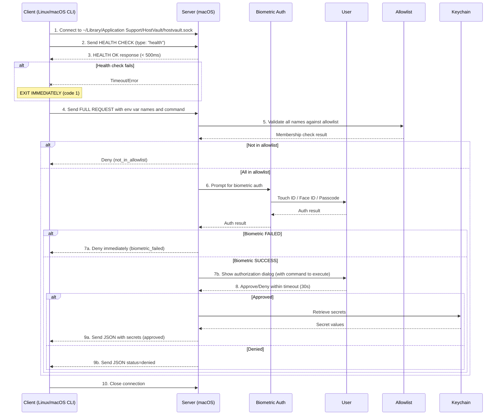

# HostVault Protocol Specification

> **Navigation**: [Overview](./README.md) | Protocol Spec | [Security Model](./SECURITY.md) | [CLI Spec](./CLI.md) | [macOS App Spec](./MACOS-APP.md) | [Test Cases](./TEST-CASES.md)

## Table of Contents

- [Socket Protocol Specification](#socket-protocol-specification)
- [Health Check Endpoint](#health-check-endpoint)
- [Message Types](#message-types)
- [Protocol Flow](#protocol-flow)
- [Request Processing Flow](#request-processing-flow)
- [Socket Path Resolution](#socket-path-resolution)

## Socket Protocol Specification

**Transport**: Unix Domain Stream Socket  
**Serialization**: JSON (newline-delimited)  
**Encoding**: UTF-8  
**Default Socket Path**: `~/Library/Application Support/HostVault/hostvault.sock`

## Health Check Endpoint

Before making a full secret request, the client **MUST** send a lightweight health check to verify server availability.

### Health Check Request

```json
{
  "version": "1.0",
  "type": "health",
  "timestamp": "ISO8601-string",
  "request_id": "uuid-v4-string"
}
```

### Health Check Response

Expected within 500ms:

```json
{
  "version": "1.0",
  "type": "health",
  "status": "ok",
  "timestamp": "ISO8601-string",
  "server_version": "1.0.0",
  "capabilities": ["biometric_auth", "allowlist"]
}
```

### Server Health Check Behavior

- Response must be returned within 100ms (no biometric/auth required)
- Simple "ping/pong" - just confirms server is running and responsive
- No auth, no allowlist checks, no logging (minimal overhead)

## Message Types

### Client → Server (Secret Request)

```json
{
  "version": "1.0",
  "request_id": "uuid-v4-string",
  "timestamp": "ISO8601-string",
  "client_info": {
    "hostname": "client-hostname",
    "user": "client-username",
    "pid": 12345,
    "cwd": "/current/working/dir"
  },
  "secrets": ["SECRET_NAME_1", "SECRET_NAME_2", "API_KEY_PROD"],
  "command": "node server.js"
}
```

**Note**: The `command` field contains the full command string that will be executed with the requested secrets. This is included in the request so the user can review what will run before approving. The `--` separator is always required; there is no mode to view secrets without executing a command.

### Server → Client (Success Response)

```json
{
  "version": "1.0",
  "request_id": "uuid-v4-string",
  "status": "approved",
  "timestamp": "ISO8601-string",
  "secrets": {
    "SECRET_NAME_1": "secret-value-1",
    "SECRET_NAME_2": "secret-value-2"
  }
}
```

### Server → Client (Denial Response)

```json
{
  "version": "1.0",
  "request_id": "uuid-v4-string",
  "status": "denied",
  "timestamp": "ISO8601-string",
  "reason": "user_denied|timeout|invalid_request|secret_not_found|not_in_allowlist|biometric_failed"
}
```

### Server → Client (Partial Success Response)

When some secrets are in allowlist but others are not:

```json
{
  "version": "1.0",
  "request_id": "uuid-v4-string",
  "status": "partial",
  "timestamp": "ISO8601-string",
  "secrets": {
    "API_KEY_PROD": "secret-value-1"
  },
  "blocked": ["UNAUTHORIZED_VAR"],
  "message": "1 secret(s) blocked - not in allowlist"
}
```

## Protocol Flow



## Request Processing Flow

1. **Health Check**: Client sends health check, waits max 500ms for response
   - **Success**: Continue to full request
   - **Timeout/Failure**: Short-circuit with exit code 1 (server unreachable)

2. **Allowlist Check**: Server checks each requested env var name against the configured allowlist
   - If ALL names are in allowlist: proceed to biometric auth
   - If ANY name is NOT in allowlist: request is partially or fully denied (exit code 8)

3. **Biometric Authentication**: LocalAuthentication framework prompt
   - Success: Continue to authorization dialog
   - Failure/Cancel: Immediate denial (exit code 9)

4. **User Authorization**: Dialog shown with client details, requested secrets, and command to execute

5. **Secret Retrieval**: If approved, values fetched from Keychain and sent to client

## Socket Path Resolution

Resolution order (highest to lowest priority):

1. `--socket` CLI flag
2. `HV_SOCKET` environment variable
3. `socket_path` in config file (`~/.config/hv/config.yaml`)
4. Default: `~/Library/Application Support/HostVault/hostvault.sock`

---

*See also: [Exit Codes](./README.md#exit-codes) in the Overview, [CLI Configuration](./CLI.md#configuration), and [macOS App Socket Settings](./MACOS-APP.md#configuration)*

---

*Document Version: 1.0*  
*Part of the [HostVault Product Requirements](./README.md)*
