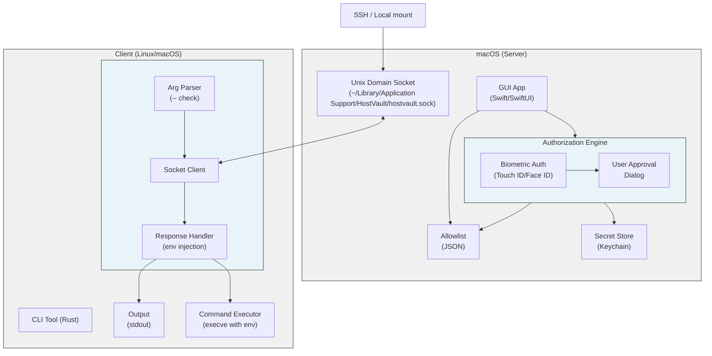

# HostVault - Product Requirements Document

## Overview

**HostVault** is a secure environment variable distribution system consisting of:
- **Server**: A macOS GUI application that stores sensitive environment variables, enforces a strict allowlist of accessible env var names, and requires biometric authentication (Touch ID / Face ID / Passcode) before authorizing access requests
- **Client**: A cross-platform CLI tool (Linux ARM64/x86_64 and macOS ARM64) that requests environment variables from the server and can execute commands with those env vars set (following the `env` tool pattern with `--` separator)

The system uses a Unix domain socket for communication and implements a multi-layer security model:
1. **Allowlist Enforcement**: Only env var names explicitly configured in the server's allowlist can be requested - all others are blocked by default
2. **Biometric Authentication**: Touch ID, Face ID, or device passcode is mandatory for ALL authorization decisions
3. **Explicit Authorization**: User must approve each request after biometric authentication

## Documentation

| Document | Description |
|----------|-------------|
| [Protocol Specification](./PROTOCOL.md) | Communication protocol, message formats, and request/response flow |
| [Security Model](./SECURITY.md) | Security features, threat model, and privacy considerations |
| [CLI Specification](./CLI.md) | Command-line tool usage, options, exit codes, and configuration |
| [macOS App Specification](./MACOS-APP.md) | Server application features, UI/UX design, and audit logging |
| [Threat Model Test Cases](./TEST-CASES.md) | Test scenarios for validating security mitigations |

## Quick Start

**CLI Usage**:
- `hv ENV1 ENV2 -- command-to-run` - Requests env vars and executes the command with those vars set

## System Architecture

### Standard Mode (Direct Connection)



### Container Mode (3-Tier with Bootstrap Proxy)

```mermaid
graph TB
    subgraph macOS["macOS (Host Server)"]
        direction TB
        GUI["GUI App<br/>(Swift/SwiftUI)"] --> AuthEngine["Authorization Engine"]

        subgraph AuthEngine["Authorization Engine"]
            direction LR
            BioAuth["Biometric Auth<br/>(Touch ID/Face ID)"] --> UserApproval["User Approval<br/>Dialog"]
        end

        GUI --> Allowlist["Allowlist<br/>(JSON)"]
        AuthEngine --> Allowlist
        AuthEngine --> SecretStore["Secret Store<br/>(Keychain)"]

        HostSocket["Host Socket<br/>(~/Library/Application Support/HostVault/hostvault.sock)"]
    end

    SSH["SSH / Forwarded Socket"] --> HostSocket

    subgraph Devcontainer["Devcontainer (Linux)"]
        direction TB
        BootstrapProxy["Bootstrap Proxy<br/>(hv-proxy)<br/>PID 1 / Early Start"]

        subgraph ExternalSocket["External Interface (Trusted Boundary)"]
            ExtSocket["Unix Socket<br/>(/run/hostvault/external.sock)<br/>0700 / 0600"]
        end

        subgraph InternalIPC["Internal IPC Plane (FD-Only)"]
            SocketPair["socketpair(AF_UNIX)<br/>No Filesystem Presence"]
        end

        subgraph ContainerClients["Container Clients"]
            ContainerCLI["hv CLI<br/>(via inherited FD)"]
        end
    end

    HostSocket --> BootstrapProxy
    BootstrapProxy --> ExtSocket
    ExtSocket -.->|Exclusive Bind| BootstrapProxy
    BootstrapProxy --> SocketPair
    SocketPair --> ContainerCLI

    style macOS fill:#f0f0f0,stroke:#333
    style Devcontainer fill:#f0f0f0,stroke:#333
    style AuthEngine fill:#e8f4f8,stroke:#333
    style ExternalSocket fill:#ffe8e8,stroke:#333
    style InternalIPC fill:#e8ffe8,stroke:#333

## Goals & Objectives

### Primary Goals
1. **Secure Secret Storage**: Store sensitive environment variables securely on macOS
2. **Explicit Authorization**: Require user approval for every secret access request
3. **Cross-Platform Support**: Server on macOS, client on Linux (ARM64/x86_64) and macOS (ARM64)
4. **Minimal Attack Surface**: Unix domain socket communication only (no network exposure)
5. **Audit Trail**: Log all authorization decisions with timestamps
6. **Devcontainer Security**: Secure containerized environments with a bootstrap proxy that creates hardened socket boundaries, preventing rogue process interference via FD-only internal IPC

### Success Criteria
- [ ] Server runs as native macOS app with menu bar/system tray integration
- [ ] Server has configuration panel to define which env var names are in the allowlist
- [ ] Only env var names in the allowlist can be accessed; all others are automatically blocked
- [ ] Touch ID / Face ID / Passcode required for ALL authorization decisions
- [ ] Client successfully connects via Unix domain socket
- [ ] All secret requests trigger GUI authorization dialog with mandatory biometric auth
- [ ] Secrets are never transmitted without explicit user approval + biometric verification
- [ ] Client receives appropriate status codes for denied/approved requests (including allowlist violations)
- [ ] Support for multiple concurrent client connections
- [ ] Secrets are encrypted at rest in macOS Keychain
- [ ] Server GUI collects access logs including successful requests, failed attempts, and authentication failures
- [ ] Server GUI provides ability to view and purge access logs with date range filtering
- [ ] Server GUI displays the command to be executed in authorization dialog and logs it

## Exit Codes

| Code | Meaning | Description |
|------|---------|-------------|
| `0` | Success | Command executed successfully with requested secrets |
| `1` | Connection Error | Health check failed, cannot connect to server, or socket not found |
| `2` | Authorization Denied | User explicitly denied the request or biometric auth failed |
| `3` | Timeout | Authorization dialog timed out |
| `4` | Secret Not Found | One or more requested secrets don't exist or have no value set |
| `5` | Invalid Request | Malformed request or invalid secret name format |
| `6` | Protocol Mismatch | Version mismatch between client and server |
| `7` | Permission Denied | Client lacks permission to access socket |
| `8` | Not In Allowlist | Requested env var(s) not in server's configured allowlist |
| `9` | Biometric Failed | Biometric authentication failed or was cancelled |
| `10` | Command Not Found | The command after `--` was not found or not executable |
| `11` | Command Failed | Command executed but returned non-zero exit code |
| `12` | Bootstrap Proxy Not Running | Container server not available at external socket |
| `13` | Internal IPC Error | Communication failure between proxy and client via socketpair |
| `14` | Socket Security Violation | External socket permission/ownership check failed |

## Implementation Phases

### Phase 1: MVP (Core Functionality)
**Duration**: 3 weeks

- [ ] Server: Socket listener with basic JSON protocol
- [ ] Server: Health check endpoint (fast, no auth)
- [ ] Server: Simple authorization dialog (Approve/Deny only)
- [ ] Server: In-memory secret storage (no Keychain yet)
- [ ] Client: Execution pattern with `--` separator
- [ ] Client: `env`-style command execution with env vars set
- [ ] Client: Health check before full requests (500ms timeout, short-circuit)
- [ ] Client: Connection error handling
- [ ] Client: Exit codes 0, 1, 2, 4, 10, 11
- [ ] Bootstrap Proxy: Binary with busybox pattern (argv[0] detection)
- [ ] Bootstrap Proxy: External socket creation with exclusive bind
- [ ] Bootstrap Proxy: Configurable socket path (default: `/run/hostvault/external.sock`)
- [ ] Bootstrap Proxy: Socket permissions enforcement (0700/0600)
- [ ] Bootstrap Proxy: Upstream connection to host server
- [ ] Bootstrap Proxy: Internal IPC plane (socketpair, no filesystem presence)
- [ ] Bootstrap Proxy: Request forwarding with client context preservation
- [ ] Client: Container mode auto-detection and internal IPC connection
- [ ] Client: Exit codes 12, 13, 14 for bootstrap proxy scenarios

### Phase 2: Security, Persistence & Allowlist
**Duration**: 3 weeks

- [ ] Server: macOS Keychain integration
- [ ] Server: Secure memory handling
- [ ] Server: Audit logging
- [ ] Server: Socket permission enforcement
- [ ] Server: Allowlist configuration panel (env var name management)
- [ ] Server: Allowlist enforcement - block non-listed env vars
- [ ] Server: Touch ID / Face ID / Passcode integration
- [ ] Server: Biometric auth before showing authorization dialog
- [ ] Client: Config file support
- [ ] Client: Exit codes 8 (not_in_allowlist) and 9 (biometric_failed)
- [ ] Protocol: Request validation (timestamps, UUID, etc.)

### Phase 3: UX & Advanced Features
**Duration**: 2 weeks

- [ ] Server: Menu bar app integration
- [ ] Server: Secret management GUI
- [ ] Server: Whitelist/remember decisions
- [ ] Server: Settings/preferences window
- [ ] Server: Log viewer with purge functionality (date range purge, export before purge)
- [ ] Client: Multiple output formats
- [ ] Client: Shell integration helpers
- [ ] Client: Status/check command

### Phase 4: Polish & Distribution
**Duration**: 1 week

- [ ] Server: Signed/notarized macOS app bundle
- [ ] Server: DMG installer
- [ ] Client: Static binary builds (Linux ARM64 + x86_64, macOS ARM64)
- [ ] Client: Debian/RPM packages
- [ ] Documentation: User guide
- [ ] Documentation: API/protocol spec
- [ ] Integration tests

## Technology Stack

**Server (macOS)**:
- Language: Swift 5.9+
- UI Framework: SwiftUI
- Socket: Foundation `FileHandle` / `Socket` or SwiftNIO
- Keychain: `Security` framework
- Build: Xcode 15+

**Client (Linux & macOS)**:
- Language: Rust 1.75+
- Socket: `tokio::net::UnixStream` or standard library
- Config: `serde_yaml`
- CLI: `clap` v4
- Build:
  - Linux x86_64: `cargo build --target x86_64-unknown-linux-musl`
  - Linux ARM64: `cargo build --target aarch64-unknown-linux-musl`
  - macOS ARM64: `cargo build --target aarch64-apple-darwin`

## Glossary

- **Secret**: Sensitive environment variable value (passwords, keys, tokens)
- **Server**: macOS GUI application that stores and authorizes secret access
- **Client**: Cross-platform CLI tool (`hv`) for Linux (ARM64/x86_64) and macOS (ARM64) that requests secrets from the server
- **Allowlist**: Explicit list of env var names that the server permits clients to request. Only names in this list can be accessed.
- **Biometric Authentication**: Touch ID, Face ID, or device passcode verification required before authorizing any secret access
- **Authorization Dialog**: GUI prompt showing request details for user approval (shown only after successful biometric auth)
- **Health Check**: Lightweight ping/pong request to verify server availability (no auth, <100ms response)
- **Command**: The full command string that the client intends to execute with the requested secrets (displayed in auth dialog and logged)
- **Command Separator**: The `--` delimiter that separates env var names from the command to execute
- **Bootstrap Proxy**: Container-side server (argv[0] = "hv-proxy") that manages socket boundaries between host server and container clients
- **External Socket**: Unix domain socket at configurable path (default: `/run/hostvault/external.sock`) - the host→container entry point with strict permissions (0700/0600)
- **Internal IPC Plane**: File-descriptor-only channel (socketpair) between proxy and clients with no filesystem presence
- **Busybox Pattern**: Single binary that inspects argv[0] to select command mode (`hv` for client, `hv-proxy` for bootstrap proxy)

---

*Document Version: 1.0*  
*Last Updated: 2024-01-15*
